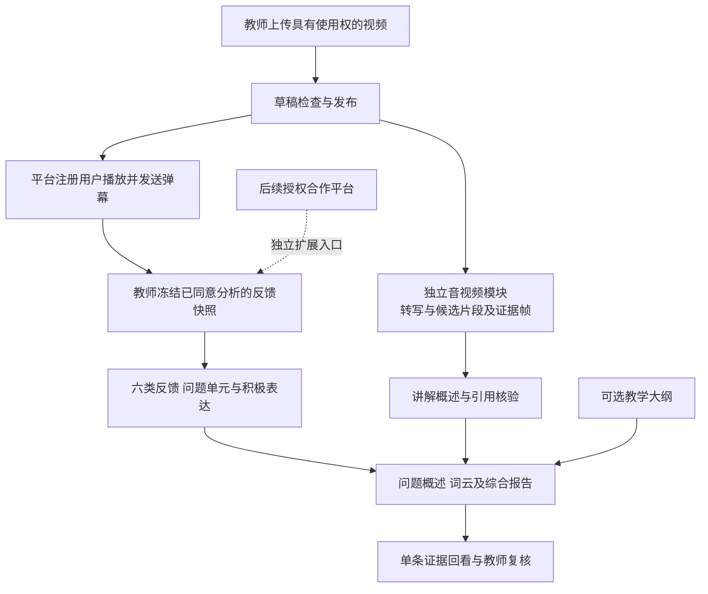

<p align="center"></p>

# 课镜 · 网课教学与反馈复盘平台

课镜提供教师视频上传与发布、课程播放和弹幕互动，并在平台内运行教学反馈分析系统。教师从学生原始表达出发，结合课程转写、证据画面和教学大纲复盘讲解。

**当前不做班级、邀请码或选课流程。** 已发布课程向注册用户开放，草稿仅上传教师可见。第三方视频平台连接保留为后续授权合作扩展，默认关闭。音视频模块按课镜课程任务独立设计。

## 当前可以做什么

- 注册与登录：首个账号初始化为教师管理账号，后续账号为学习者；教师只能管理、分析本人课程。
- 上传与发布：支持含AAC音轨的H.264 MP4，最大512MB；上传进度、媒体校验、草稿及发布状态均有实际后端。
- 播放与互动：视频支持拖动播放，弹幕按播放时间显示；可以发送、回看、撤回，教师可隐藏本课不适当内容。
- 教师分析：冻结同意本地分析且未撤回的弹幕，生成问题、词云、讲解概述和原文依据，保留教师复核记录。
- 独立音视频处理：仅处理选定时长，输出时间戳转写、画面变化候选、实际帧时间和可引用证据。

未选择模型分析的弹幕仍可正常参与课堂互动。平台材料默认可用本地推理；API分析需教师确认课程材料处理范围，并仅纳入学生另行同意发送至该具体服务的弹幕。此授权筛选已完成单元测试，真实平台材料的远程全链路仍待验证。校园服务器【待真实接入测试】。

## 使用顺序

1. 打开平台并注册首个教师账号。
2. 填写课程标题、选择视频，确认拥有相应权利或已获授权，上传后先检查草稿再发布。
3. 学习者注册登录后直接查看已发布课程，播放并发送弹幕，可单独选择是否同意此条用于本地分析。
4. 教师从课程进入“复盘本课”，在齿轮设置中选择已部署的本地模型，确定分析范围并生成报告。
5. 点击结论查看单条依据及讲解，保存复核记录。撤回反馈后旧报告暂停访问，重新生成会排除相应记录。



六类反馈为问题与求助、知识交流、理解自述、学习情绪、教学评价、改进建议。画面变化只提供分段候选，引用编号存在只证明结构有效，分类与证据的语义正确性仍需人工评价。当前不生成课程总分、等级或真实掌握率。

## 本地启动

Windows PowerShell，Python 3.10以上：

```powershell
git clone https://github.com/Hyhyhyyy/OnlineCourseFeedbackPlatform.git
cd OnlineCourseFeedbackPlatform
python -m venv .venv
.\.venv\Scripts\python.exe -m pip install -r requirements-media.txt
.\.venv\Scripts\python.exe src/data_server.py --port 8766
```

打开 [课镜平台](http://127.0.0.1:8766/)。上传和互动无需大模型；报告分析需先按[本地部署说明](docs/local-model-deployment.md)安装语音模型、Qwen3.5-4B及视觉投影权重与运行器，再使用 `start-local-demo.ps1`。模型端口8081，平台端口8766；下载模型与首次分析需要额外时间和资源。

教师工作台位于 `/workspace?course=课程编号`，从课程按钮进入即可。模型未就绪时前后端均锁定报告生成。真实数据、密码摘要、会话、权重和运行缓存只保留在本地，不随Git仓库上传。

## 验证情况与限制

58项单元测试通过。2026年9月16日使用自制15.42秒合成课程和100条模拟反馈，实际完成本地Qwen3.5-4B多模态分析，生成100条分类、53个问题单元、4段转写、1张证据画面和1个讲解片段，首次运行462.825秒。问题概述、词云、单条证据、教师复核和HTML/JSON导出均已有后端。登录权限、视频范围请求和撤回失效通过HTTP验证。详见[当前演示说明](docs/demo-guide.md)；原先的小样本记录保留用于来源追溯。

该测试证明工程链路，不是真实学生实验，也不代表准确率。真实教师材料、自然反馈规模、知识点分段质量及教师效用尚需评价。此前第三方课程试验仅保留为历史工程依据，不转为自有课程或新平台自然样本。

当前为本机试验版：首个账号初始化方式不适合公网教师资格管理，尚未完成校园部署、完整数据删除策略、配额及大规模互动性能测试。自建平台不自动消除版权义务，上传者声明仍需结合权利证明与研究范围核对。

## 工程与研究文档

| 入口 | 内容 |
|---|---|
| [平台说明](docs/platform.md) | 账号、上传、播放、弹幕与快照流程 |
| [独立音视频模块](docs/course-av.md) | 实际处理步骤、输入输出与局限 |
| [src/teaching_platform.py](src/teaching_platform.py) | 平台数据、会话、课程权限与弹幕快照 |
| [src/course_av.py](src/course_av.py) | 语音转写、画面变化候选及证据帧 |
| [src/workbench.py](src/workbench.py) | 分析任务和报告串联 |
| [web/](web/) | 平台和教师工作台界面 |
| [当前项目材料](project-materials/) | 当前申报书、设计、计划与依据资料 |
| [组件来源](docs/sources.md) | 使用的开放模型与媒体组件 |

```powershell
$env:PYTHONPATH = 'src'
.\.venv\Scripts\python.exe -m unittest discover -s tests
```

中期重点是自然数据积累、人工标注、问题覆盖与条件保护、片段关联和教师任务评价。约三万条是逐步积累目标，不承诺每课一万条，不以合成或重复弹幕凑足数量。后期开展计算机课程迁移和校园试点。

## 外部平台合作扩展

原B站接入代码继续保留在仓库，默认不作为主入口，也不自动导入旧材料。确认合作数据范围后，可设置 `COURSE_EXTERNAL_ENABLED=1` 启用教师扩展测试；相关代码为 `src/acquire_course.py`、`src/fetch_course.py` 和 `src/bilibili_login.py`。API配置与历史验证见[API说明](docs/api-setup.md)。外部采集、模型传输及公开展示需分别核对范围。


## 品牌视觉

<p align="center"></p>

Logo以书页、窗口与双向交流表达课程和反馈的关系。“小镜”用于欢迎和操作引导，正式教师报告以Logo为主。首页和工作台已接入品牌资源，独立HTML报告内嵌Logo，无需联网加载。

品牌主色为学术蓝 `#244A70` 与青绿 `#39877E`，辅以暖白和少量琥珀黄。[资源与使用说明](brand/README.md)包含透明PNG、几何SVG图标及配色。当前为AI辅助设计的基础视觉，尚未完成商标检索或学校品牌授权。
