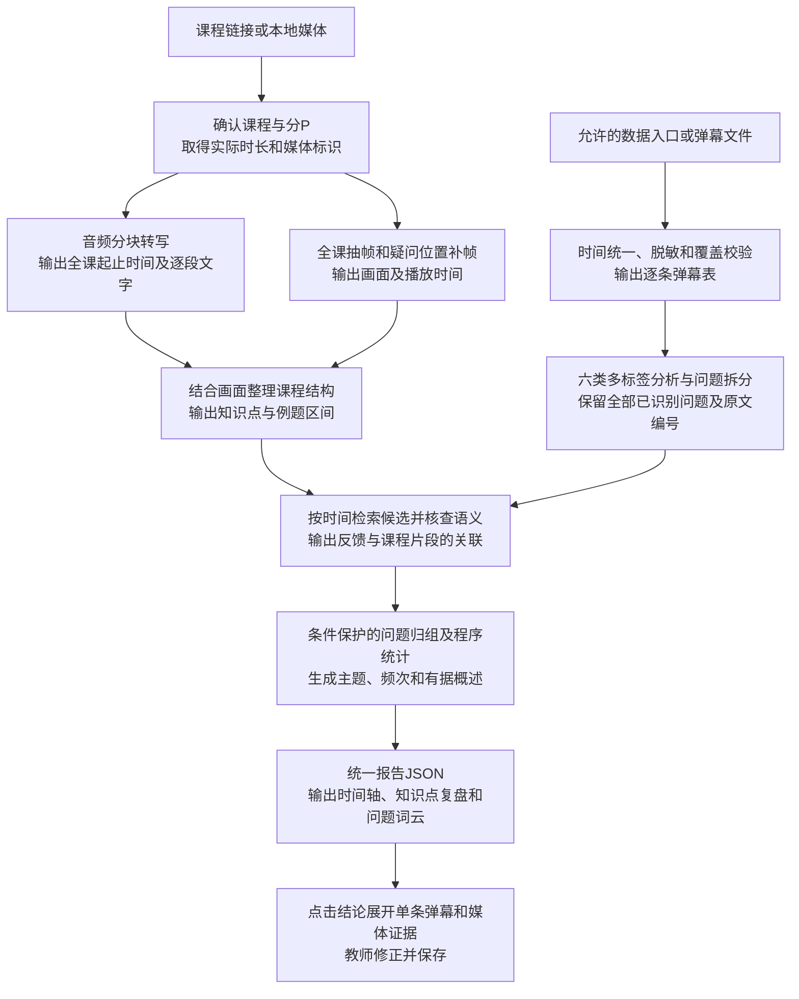

# 课镜：课程反馈工作台

当前已接通真实素材获取、弹幕分析、完整本地音视频处理、证据回看与教师复核。详见[工作台说明与实测](docs/workbench.md)。运行 `python src/serve_demo.py` 后打开 http://127.0.0.1:8766/ 。

面向Bilibili录播网课的弹幕驱动多模态教学反馈解析系统。通过带播放时间的弹幕、课程转写与关键画面，帮助教师定位问题、保留有效讲解并复盘课程。

## 项目基础与来源

本项目以 [FrameScope](https://github.com/chaojixinren/FrameScope) 的音视频处理、时间戳溯源与交互报告设计为基础，扩展面向教学反馈的分析流程。参考核验提交为 `90261750b0b812d692e51220d01d35d1020c2b58`。

当前仓库包含本项目自行编写的导入、转写、反馈分析和报告Demo，兼容FrameScope的转写JSON结构，尚未复制其源码。核验时未发现其LICENSE文件，后续代码复用范围需要明确。本项目与FrameScope作者不存在已确认的合作或背书关系。详见 [来源说明](ATTRIBUTION.md)。

## 当前状态

已验证：JSON/CSV/XML弹幕导入、FrameScope结构转写导入、规则基线问题解析、计数与引用核验、交互报告、单条证据查看及教师记录保存。合成数据18条中有效15条、重复请求1条、异常2条，产生10个问题单元。本地Whisper tiny已在合成中文语音上实际推理，视频测试完成分块及取帧。

已实测前端“获取数据”：目标课程BV1Y2DGYoEEw取得7200条带时间戳弹幕及1080p含音轨视频，57.652秒完成。获取目标为当次可用快照。官方扫码登录入口已加入并验证二维码生成，真人确认后的会话接续待用户扫码验证。详见[真实获取记录](docs/real-acquisition.md)。

尚未完成：真实课程的模型分析、知识点自动分段、视觉语义核查及自动教学改进判定。当前主按钮仅获取数据，不直接启动分析。

本地Qwen3-0.6B也已实际调用并生成报告，但在预设合成用例中将6条非问题误报为问题，未通过语义检查。保留该结果作为调试证据，不作为正式分析模型。

指定54分钟课程现已完成真实获取、完整本地转写取帧、规则反馈报告与复核保存。语义准确率和教学效用仍待独立评价。合成演示用于回归测试。实际范围和复现方法见[Demo运行说明](docs/demo-runbook.md)及[试验记录](docs/demo-trial.md)。

## 打开真实获取页面

```powershell
python -m venv .venv
.venv/Scripts/python.exe -m pip install -r requirements-media.txt
.venv/Scripts/python.exe src/serve_demo.py
```

打开 `http://127.0.0.1:8766`，输入B站完整视频链接，按需登录后点击“获取数据”。无需配置分析模型。会话不自动继承其他浏览器登录状态，用户可通过页面内官方扫码流程连接。

## 运行合成数据报告演示

```bash
python src/run_demo.py --comments examples/comments.synthetic.json --transcript examples/transcript.synthetic.json --duration 3240 --title "导数课程复盘 · 合成数据功能演示" --data-kind synthetic --out outputs/synthetic-demo
```

运行服务后，可通过 `/example` 单独打开该合成演示。

## 运行前置检查

需要Python 3.10或以上；该检查只使用标准库。

```bash
python src/preflight.py --config config/trial.example.json --output outputs/preflight.json
```

配置中的素材路径可为绝对路径，或相对于配置文件的路径。模型地址与名称只检查是否填写，不调用服务。敏感配置、素材、日志与输出应保留在本地。

## 设计流程



六类反馈包括问题与求助、知识交流、理解自述、学习情绪、教学评价、改进建议。具体疑问、笼统求助和纯情绪表达分别记录；问题归组保留原文、低频问题及条件差异。反馈数量不直接代表掌握程度或教学质量。

## 开发安排

1. 前期：落实真实输入，接通音视频与弹幕处理，完成一课报告与逐条证据点击，保存实际试验结果。
2. 中期：围绕三课约三万条弹幕开展人工标注、误差分析、模型优化、独立课程验证与教师试用。
3. 后期：开展计算机课程迁移及持续试用，根据结果确定推广边界。

项目设计与源码核验见 [接入方案](docs/framescope-integration.md)。数据取得须符合适用的平台条件和研究安排；浏览器登录状态不会自动传递给独立下载程序。
