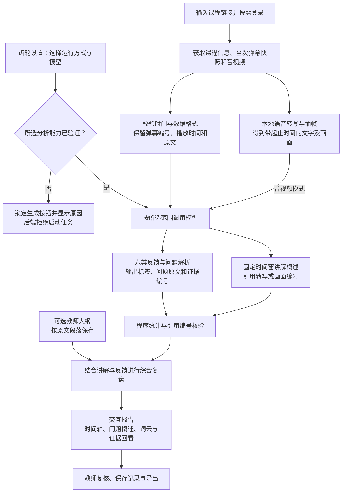

# 课镜 · 教学反馈复盘工作台

课镜面向 Bilibili 公开录播网课，通过带播放时间的弹幕呈现学生反馈，再结合课程转写、关键画面和教师教学大纲，帮助教师定位疑问、回看讲解、保留积极反馈并记录改进措施。

当前为立项研究 Demo：**真实课程素材获取与本地100条弹幕的报告闭环已跑通**。API 接入和模型权限控制已实现，远程完整报告仍待跑通；校园服务器保持【待真实接入测试】。反馈线索不能直接证明学生掌握程度，当前不生成课程质量总分或等级。

## 从课程链接到复盘报告

1. **获取素材**：输入 B 站链接，按需完成页面内官方扫码登录，点击“获取数据”。进度区显示各步骤、实际保存内容和失败原因，弹幕取得范围为当次可用快照。
2. **连接模型**：点击导航栏齿轮，打开独立设置面板，选择大模型 API、离线本地或校园服务器。API 模式填写 Key、刷新候选模型并验证调用。
3. **选择范围**：默认使用前5分钟、100条抽样；选择弹幕反馈分析，或加入音视频上下文。可导入 DOCX、TXT、Markdown 教学大纲，也可粘贴原文。
4. **生成并回看**：查看弹幕分布、时间窗讲解概述、反馈类别、问题概述与词云、积极表达及综合复盘；点击相关结论查看单条弹幕依据。
5. **教师复核**：确认线索或排除误判，保存改进记录，导出报告。最近一次分析失败时可查看上次成功报告，页面会明确提示其来源。



六类反馈为**问题与求助、知识交流、理解自述、学习情绪、教学评价、改进建议**，允许多标签。具体提问、笼统求助和纯情绪表达分别记录，积极表达同时保留。程序核验引用编号存在，但引用是否充分、分类是否准确仍需人工评价。详细方法见[反馈判定与报告依据](project-materials/03_研究与实验/教学反馈判定细则与报告依据.md)。

## 当前验证范围

| 环节 | 已取得的证据 | 仍需完成 |
|---|---|---|
| 真实素材获取 | BV1Y2DGYoEEw 的约54分钟课程，7200条带时间戳弹幕及含音轨视频 | 其他课程、账号和网络条件下的稳定性验证 |
| 音视频处理 | 整课1506段转写草稿及28张画面 | 数学术语转写纠错、自适应知识点边界识别 |
| 离线模型闭环 | Qwen3.5-4B 与 Whisper tiny；前5分钟100条去重后抽样弹幕，结合153段转写和3张画面生成报告 | 标注后分类准确率、问题归组质量和教学效用评价 |
| API 接入 | 百炼目录实测返回174个模型，qwen-plus 合成 JSON 文本探测成功 | 后续真实课程调用曾返回参数或模型能力不匹配，完整远程报告及视觉链路待验证 |
| 校园服务器 | 配置入口与权限逻辑已实现，保持锁定 | 【待真实接入测试】，未执行校园网络试用 |
| 教师大纲 | 原文导入、存储与报告接入已实现 | 真实教师大纲的对应效果与教师试用 |

本地100条试验输出包含23个问题单元、25个词云词项、7条积极表达候选和1个时间窗讲解概述。试验中已发现误读、误分类及数学转写错误；这些数量是功能输出记录，不能用作准确率或全课反馈比例。详情见[试验报告](project-materials/07_实际试验/BV1Y2DGYoEEw_完整课程试验报告.md)与[本地部署说明](docs/local-model-deployment.md)。

## 快速启动

当前启动脚本针对 Windows PowerShell。需要 Python 3.10 或以上；模型权重、运行器与真实课程数据不随仓库提供。

```powershell
git clone https://github.com/Hyhyhyyy/course-feedback.git
cd course-feedback
python -m venv .venv
.\.venv\Scripts\python.exe -m pip install -r requirements-media.txt
.\.venv\Scripts\python.exe src/data_server.py --port 8766
```

打开 [本地工作台](http://127.0.0.1:8766/)。首次进入时课程链接为空，输入自己的链接后获取素材。安装依赖不等于完成离线部署；音视频转写所需权重也须按部署说明准备。

使用后台启动脚本时，先创建日志目录：

```powershell
New-Item -ItemType Directory -Force outputs | Out-Null
.\start-workbench.ps1
```

### 模型设置与开放规则

- **大模型 API**：刷新列表只获取厂商候选目录，不能证明每个模型均有调用权限。文本分析需通过文本验证，音视频辅助分析还需图文验证；验证请求可能产生少量费用。
- **离线本地**：按[部署说明](docs/local-model-deployment.md)准备 Qwen3.5-4B、视觉投影权重、llama.cpp 与语音模型，再运行 `start-local-demo.ps1`。当前脚本采用 CPU，模型端口8081；在设置面板选择本地模式。
- **校园服务器**：定位为面向在校师生、由校园服务器支持的日常便捷教学辅学工具。当前保持【待真实接入测试】，暂不开放分析。

API 验证有效期为15分钟；更改配置或模型、验证过期、连接或分析异常后重新锁定。前后端共同检查权限，任务执行期间禁止切换配置。已有数据和报告可独立查看。完整逻辑见[模型操作开放规则](docs/model-access.md)。

Key 在输入框中以掩码保留，在后端仅保存在服务内存，不写入浏览器持久存储、源码或报告；重启服务后需要重新填写并验证。查询时显示等待秒数，减少重复状态请求；不承诺固定调用速度。用量来自当前连接返回的 Token 计数，不能代表账户总账单；不支持余额查询的厂商会明确提示。厂商说明和操作方法见[API 接入文档](docs/api-setup.md)。

## 文件导航

| 路径 | 内容 |
|---|---|
| [src/data_server.py](src/data_server.py) | 本地 HTTP 服务、素材获取与分析任务入口 |
| [src/workbench.py](src/workbench.py) | 分析范围、媒体处理、模型调用及报告串联 |
| [src/local_model.py](src/local_model.py) | 本地及远程模型调用、缓存和结构化结果核验 |
| [web/](web/) | 工作台、独立模型设置面板和交互报告 |
| [tests/](tests/) | 数据解析、模型接入、权限与报告相关测试 |
| [docs/](docs/) | 当前工程说明、调用链、部署与验证记录 |
| [project-materials/](project-materials/) | 当前申报草稿、分阶段计划、研究依据及试验图文 |
| [examples/](examples/) | 无需真实课程数据的合成输入 |

研究总图见[研究与工程总图](project-materials/01_项目设计/研究与工程总图.md)，具体调用链见[Demo流程](docs/demo-flow.md)，申报草稿见[申报书](project-materials/04_申报与答辩/申报书_教师反馈主线.md)。研究材料包含未来计划，当前实现以源码及工程验证记录为准。

## 验证与合成演示

```powershell
$env:PYTHONPATH = 'src'
.\.venv\Scripts\python.exe -m unittest discover -s tests
.\.venv\Scripts\python.exe src/run_demo.py --comments examples/comments.synthetic.json --transcript examples/transcript.synthetic.json --duration 3240 --title "课程复盘 · 合成演示" --data-kind synthetic --out outputs/synthetic-demo
```

最近一次回归运行46项测试通过。合成演示检查基础输入输出与引用结构，不代表模型分析效果，也不能替代真实课程试验。

## 研究安排与数据边界

前期以现有开源模型完成可复现的输入、分析、证据回看与报告闭环。中期围绕三门课程、每课约一万条弹幕开展人工标注、误差分析、模型优化、独立验证与教师试用；专用训练权重目前尚未训练。后期再进行计算机课程迁移和持续试用，根据验证结果确定推广范围。详见[分阶段计划](project-materials/01_项目设计/分阶段开发与成果计划.md)。

仓库不包含真实视频、原始弹幕、含逐条真实弹幕的交互报告、Key、登录凭据、模型权重及运行缓存。这些文件保留在本地，因此克隆仓库不会直接获得现有真实课程报告。API 模式会向所配置服务发送经遮盖处理的材料，该处理不能保证任意身份信息均被移除；数据取得、使用与对外发送应结合实际授权和研究安排核对。服务当前仅面向本机，尚未实现多用户账户隔离。

## FrameScope 基础与来源

本项目以 [FrameScope](https://github.com/chaojixinren/FrameScope) 的音视频处理、时间戳溯源和交互报告设计为参考基础，自行实现面向教学反馈的工作台。参考核验提交为 `90261750b0b812d692e51220d01d35d1020c2b58`；当前仓库没有复制其源码，产品界面统一使用课镜名称。

核验时未发现上游明确的 LICENSE 文件，后续直接代码复用需明确许可条件。本项目与原作者不存在已确认的合作或背书关系。来源、复用范围与声明见 [ATTRIBUTION.md](ATTRIBUTION.md)。
