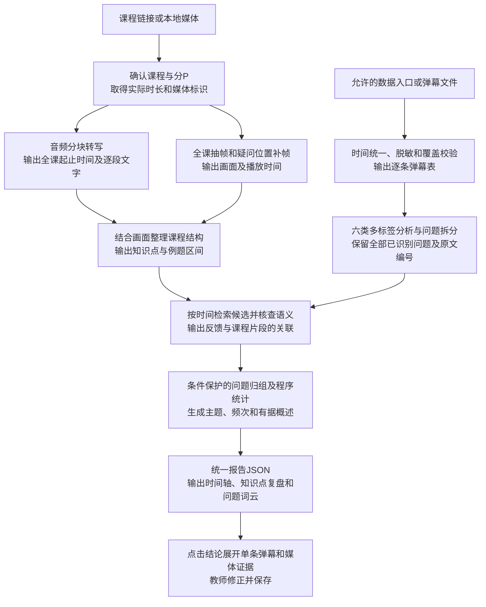

# Course Feedback｜课程教学反馈复盘系统

面向Bilibili录播网课的弹幕驱动多模态教学反馈解析系统。通过带播放时间的弹幕、课程转写与关键画面，帮助教师定位问题、保留有效讲解并复盘课程。

## 项目基础与来源

本项目以 [FrameScope](https://github.com/chaojixinren/FrameScope) 的音视频处理、时间戳溯源与交互报告设计为基础，扩展面向教学反馈的分析流程。参考核验提交为 `90261750b0b812d692e51220d01d35d1020c2b58`。

当前仓库包含本项目自行编写的前置检查程序、配置与设计文档，尚未复制或集成FrameScope源码。核验时未发现其LICENSE文件，后续代码复用范围需要明确。本项目与FrameScope作者不存在已确认的合作或背书关系。详见 [来源说明](ATTRIBUTION.md)。

## 当前状态

已实现：本地素材路径、文件校验值、模型配置与Python依赖的前置检查。

待实现：弹幕在线连接器与文件解析、可替换的分块转写、课程结构与画面索引、六类反馈与全部问题解析、证据关联、交互报告及教师修订。

尚未完成真实完整课程的端到端分析，不提供虚构结果。前置检查不下载视频、不调用模型；当前始终返回未进入推理状态，退出码2表示完整分析流水线尚不可运行。

## 运行前置检查

需要Python 3.10或以上；该检查只使用标准库。

```bash
python src/preflight.py --config config/trial.example.json --output outputs/preflight.json
```

配置中的素材路径可为绝对路径，或相对于配置文件的路径。模型地址与名称只检查是否填写，不调用服务。敏感配置、素材、日志与输出应保留在本地。

## 设计流程



六类反馈包括问题与求助、知识交流、理解自述、学习情绪、教学评价、改进建议。具体疑问、笼统求助和纯情绪表达分别记录；问题归组保留原文、低频问题及条件差异。反馈数量不直接代表掌握程度或教学质量。

## 开发安排

1. 前期：落实真实输入，接通音视频与弹幕处理，完成一课报告与逐条证据点击，保存实际试验结果。
2. 中期：围绕三课约三万条弹幕开展人工标注、误差分析、模型优化、独立课程验证与教师试用。
3. 后期：开展计算机课程迁移及持续试用，根据结果确定推广边界。

项目设计与源码核验见 [接入方案](docs/framescope-integration.md)。数据取得须符合适用的平台条件和研究安排；浏览器登录状态不会自动传递给独立下载程序。
