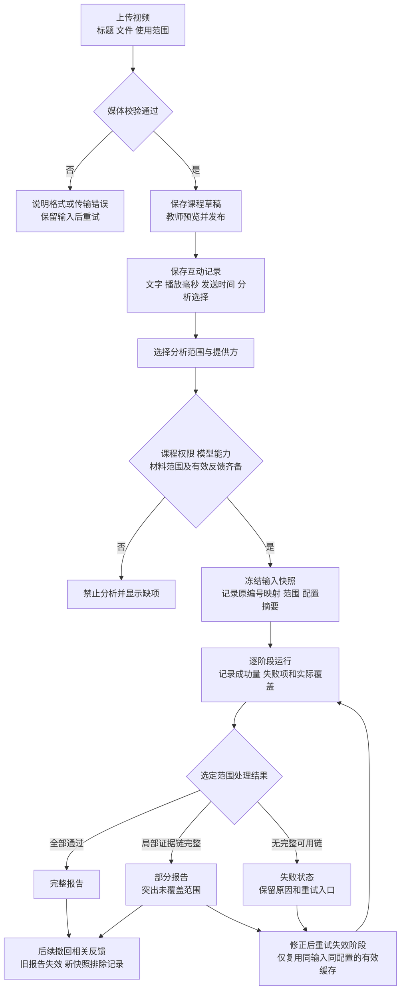
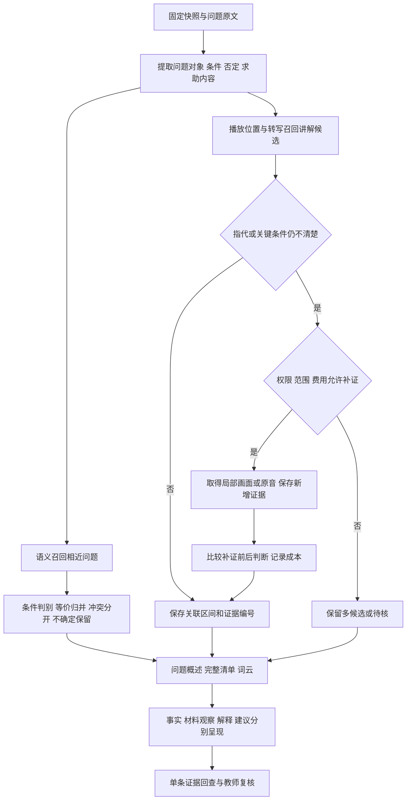
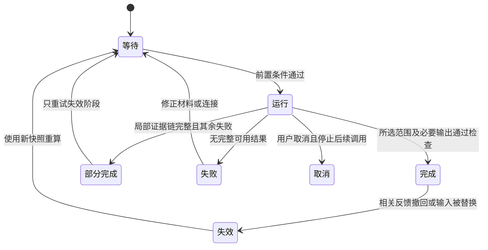
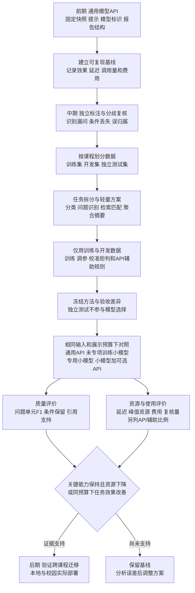

# 课镜网课平台与教学反馈系统开发文档

正式项目名称：面向网课教学复盘的轻量化多模态反馈分析方法研究与平台开发  
平台名称：课镜  
文档类型：产品需求与研发实施文档（PRD）  
整理日期：2026年9月15日  
适用团队：大连理工大学软件学院四人项目组  
状态：开发基线，研究效果及部署能力按本文分别验收

## 1 产品目标与研究目标

课镜提供课程上传、发布、播放和带播放时间的弹幕互动。教师据此查看学生提出的问题、积极反馈及改进意见，结合对应讲解、画面和可选教学大纲完成课程复盘。平台承担教学材料与反馈形成，分析系统承担证据组织，两者共同形成“课程发布—课堂互动—报告核查—教学改进”的工作流程。

教师的具体困难是：反馈数量较多且表达零散，难以在有限时间内找到不同问题、理解它们指向的讲解，并判断哪些结论有原文支持。因此，首要产品目标是缩短教师查找和核实反馈的过程；主研究检验经过领域标注训练的轻量方法能否以较低推理成本保持或改善问题识别与关键条件保留；音视频辅助定位为辅助研究，教师任务用于验证使用价值。平台与六类视图是研究基础和产品功能，不分别承诺方法创新。

本文件依据当前自有平台设计、申报书中的方法与实验安排、仓库实际接口及已有试验记录整理。它用于指导实现，不能作为功能已完成或模型准确的证明。个性化推荐不纳入当前范围。

### 1.1 范围与优先级

| 优先级 | 交付范围 | 完成条件 |
|---|---|---|
| P0 基本闭环 | 注册登录、教师上传发布、播放、弹幕、分析选择、固定快照、独立音视频处理、模型配置、证据报告 | 授权真实课程能完成一轮互动到报告核查；失败与部分完成如实显示 |
| P1 中期升级 | 标注工具与数据集、问题拆分与聚合升级、语义辅助定位、报告改进、大纲关联、对照实验 | 在独立课程上给出方法及教师任务结果 |
| P2 后期扩展 | 校园多用户部署、跨学科验证、运行维护与合作接口 | 完成真实环境测试后才开放对应能力 |

首期不做班级、邀请码、选课审批。课程总分、质量等级、选课排行榜、真实知识掌握率和心理状态诊断不在范围内。第三方视频平台代码保留为默认关闭的合作入口，启用不代表取得材料处理许可。

### 1.2 自研业务流程与开源组件分工

平台采用自研业务流程加成熟开源组件。课程发布、时间戳弹幕、分析选择、固定快照、证据报告和教师复核由课镜自主设计，统一围绕研究任务组织。MediaCMS停止作为实施主线，仅保留选型参考；其容器部署状态不再是课镜开发的前置条件。

| 层次 | 自研内容 | 复用边界 |
|---|---|---|
| 教学业务 | 课程草稿与发布、教师权限、互动、撤回、报告行动 | 使用框架与数据库的基础能力，业务规则由课镜定义 |
| 播放与弹幕 | 播放位置绑定、单条证据跳转、分析选择 | 评估成熟播放器及弹幕组件；组件不承担服务端授权和持久化 |
| 媒体处理 | 分析范围、证据编号、片段组织、缓存策略 | 复用FFmpeg、PyAV及专用转写或识别模型 |
| 模型与研究 | 任务拆分、输入输出契约、引用核查、模型对照 | 前期通用API，后续可替换轻量专用权重 |
| 运行基础 | 任务状态、配额、恢复与数据生命周期 | 当前数据库及服务先保持可运行；成熟后台框架和队列按实际负载评估接入 |

选型按“满足当前任务、许可明确、可测试、可替换”逐项确认，不一次性引入整套平台。播放器、数据库或队列更换前，须复测上传播放、权限拒绝、时间对齐、撤回失效及报告引用。自研业务不等于自行编写视频解码器、密码算法或数据库引擎；开源依赖保留版本、许可证和必要署名。平台工程复用与轻量化方法的研究贡献分别说明。

## 2 用户与权限

教师负责上传、发布、查看本人课程的分析结果及保存复核意见。学习者查看已发布课程，在当前播放位置发送反馈，并决定其反馈是否参与分析。校园管理者属于后期角色，负责教师资格、资源配额和运行管理，不默认获得课堂原文的无限访问权。

当前试验采用“首个注册账号为教师，后续为学习者”的初始化方式。校园部署前必须替换为受控的教师资格管理。登录状态、教师身份、课程所有权在服务端逐项检查，前端隐藏按钮只承担提示作用。

| 操作 | 未登录 | 学习者 | 课程所属教师 |
|---|---|---|---|
| 查看课程视频与互动 | 登录后使用 | 已发布课程 | 本人草稿及已发布课程 |
| 上传与发布 | 禁止 | 禁止 | 允许 |
| 发弹幕及撤回本人记录 | 禁止 | 在可访问课程中允许 | 在可访问课程中允许 |
| 生成报告与查看报告原文依据 | 禁止 | 禁止 | 允许，另检查模型与数据条件 |
| 隐藏不适合展示的弹幕 | 禁止 | 禁止 | 本人课程允许，保留处理记录为后续要求 |

## 3 主要使用流程

### 3.1 教师发布课程

教师登录后填写课程标题，选择视频并确认拥有相应使用权。上传进度反映实际已传字节；传输完成后进入媒体校验，不能立即显示“课程已发布”。校验通过生成课程草稿，教师预览后主动发布。可选教学大纲可在分析前补充，不作为上传的必要条件。

当前支持不超过512MB、H.264视频与AAC音轨的MP4。格式不支持、文件损坏、连接中断或写盘失败时，显示具体失败阶段，不生成可播放课程。分片续传、转码及更大文件属于后续工程扩展。

### 3.2 学习者观看与互动

学习者进入已发布课程，使用播放器播放、暂停和跳转。在发送时读取播放器位置并与文字一起保存；该位置表示反馈所处的课程时间，与发送的日历时间分别记录。文字上限300字，当前发送间隔为2秒。发送成功后显示“弹幕已发送”及播放位置；失败保留输入内容。

是否用于分析单独选择，未同意分析仍可观看与互动。本地分析与指定外部服务的分析选择分别记录。服务地址变化后，旧的外部选择不自动适用于新接收方。报告不展示用户名或账户标识。

### 3.3 教师分析与复盘

教师从课程页进入工作台，先查看材料完整性，再选择分析范围、模型运行方式及可选大纲。系统检查权限、模型能力和可分析弹幕，随后冻结本次输入。任务完成后先展示实际处理范围与数量，再展示内容片段和反馈结果。教师点击结论进入原文依据，回看片段后保存“确认、驳回、待核”及行动记录。

没有弹幕时可展示课程资料；若开展纯内容处理，应明确其不包含学生反馈结论，不能以空反馈生成课程评价。现有反馈分析接口对没有符合条件的弹幕返回阻止状态。

## 4 页面与交互要求

主页面由课程广场、上传入口和账号入口组成；课程页以播放器和弹幕讨论为核心；教师工作台承载材料检查、任务进度和复盘报告。模型设置在独立可打开页面选择API、本地或校园模式，入口图标显示当前就绪状态。

报告由上至下依次呈现：实际处理范围与显著数量、课程片段时间轴、六类反馈与问题全景、证据详情、教师行动。知识点候选数量、有效反馈数量使用醒目的数字与明确单位，不将尚未确认的片段称为准确知识点。固定不变的说明放帮助区，首页不反复占据空间。

图表必须有标题、单位、统计范围和空状态。多标签类别人数或条数不能相加当作独立弹幕总数。密度图表示播放位置上的记录分布，不能表述为同一学生的情绪轨迹。词云是进入问题清单的索引，不能代替问题摘要。

中文采用华文中宋，英文采用Times New Roman，并提供系统字体回退。延续玻璃拟态风格，同时保证正文对比度、键盘操作和窄屏阅读；状态同时使用文字与颜色表达。

### 4.1 操作开放条件

| 操作 | 开放前提 | 不满足时的行为 |
|---|---|---|
| 发布课程 | 上传及媒体校验成功、拥有课程 | 显示待补材料或校验错误 |
| 查询模型 | 厂商、地址及必要凭证有效 | 输入保持可见或密码掩码；显示查询中及失败原因 |
| 生成反馈报告 | 课程权限、有效快照、对应模态能力探测成功、所需分析选择齐备 | 前端禁用并说明原因；服务端再次拒绝 |
| 查看既有报告 | 报告生成完成且未因撤回失效 | 显示任务状态或重新分析入口 |
| 修改模型配置 | 没有受影响的运行任务 | 提示等待；后期改为任务绑定配置后允许独立修改 |

配置被修改、凭证失效或能力探测失败时，撤销就绪状态。拉取到模型名称不等于模型可调用；文本和视觉能力分别验证。用量区区分本系统记录的调用量与厂商账户余额，厂商未提供余额接口时显示“暂不支持查询”，不能显示为零。模型价格与候选列表从厂商适配器更新，不在文档中固定为最新清单。

## 5 音视频分析模块

本模块独立围绕教师复盘设计，输入为课程视频、起止范围及处理配置，输出为带时间的转写、候选片段、代表画面和运行记录。转写、片段和画面均须保留可定位编号，供后续结论引用。

当前实现使用Whisper开放权重进行语音转写：按180秒分块，相邻块重叠1秒，按句段中点归属以减少重复。输出起止时间、文本及识别分数。当前画面每5秒采样，通过缩小灰度图的变化生成候选分界，候选长度约束为30至180秒；课程尾段及短视频允许不足30秒。随后重新解码代表画面，记录实际帧时间。

这些参数是可复现的初始实现，尚未验证为最优配置。画面变化不能直接确定知识点，转写识别分数也不能证明数学公式正确。中期加入人工片段标注，比较固定时间窗、画面变化和语义辅助分段。公式识别、上下文补证按具体问题触发，并保存补证材料及结论变化，避免无目的地处理全部画面。

| 输出文件或对象 | 必要内容 | 下游用途 |
|---|---|---|
| transcript.json | 句段编号、起止时间、转写、识别线索 | 讲解检索、原音回听 |
| windows.json | 候选起止位置、分界方法 | 建立片段索引 |
| frames.json与画面文件 | 画面编号、实际时间、所属候选片段 | 板书或课件局部核查 |
| media_run.json | 媒体与权重摘要、参数、实际范围、错误 | 复现及缓存有效性检查 |

### 5.1 按需补证的目标流程

先以问题及播放位置检索转写；出现指代未解析、多个讲解候选冲突或关键数学条件无法核查时，才触发局部画面、OCR或原音补证。每次保存触发原因、候选区间、补充材料编号、前后判断及新增耗时和调用量。调用范围、次数和费用上限在任务开始时绑定配置；超出上限则保留待核，不静默扩大视频范围或切换外部服务。补证仍须满足材料和接收方授权。

## 6 弹幕处理与报告生成

### 6.1 表达分类

六类并列展示并允许多标签：问题与求助、知识交流、理解自述、学习情绪、教学评价、改进建议。积极表达在相应类别中保留；倾向与表达类别分别记录。无法判断的记录保留待核状态。

“啊啊啊太难了”可属于学习情绪；“这一步为什么可以换元”属于具体问题；“没听懂，再讲一下”属于笼统求助。不能把所有困惑压缩为负面情绪，也不能为笼统求助补写原文没有提出的具体问题。

### 6.2 问题、聚合与定位

一条弹幕可拆出多个问题单元。“为什么能约掉x，x等于零怎么办”分别保留约分依据和零值条件，并共同引用原弹幕。问题单元记录对象、条件、否定、原文短语和具体或笼统类型。归并只合并信息需求等价的表达，不同条件与否定必须可区分。

先按播放位置及向前回溯召回讲解，再比较语义和必要画面；时间接近只作为候选线索。定位不足时保留多候选或未定位，不强制赋予知识点。完整清单保留低频问题、笼统求助和待核项。所谓“保留全部问题”是工程目标，需通过人工漏检评价检验，不能作为未经测量的模型保证。

中期拟采用“语义召回—条件冲突判别—保留映射的归并”流程。先召回相近问题，再比较对象、条件、否定与所求内容；“非零时为何能约分”与“等于零时还能否约分”不可直接合并。规则、成对判别及对比学习作为候选方法，仅用开发集选型。保存问题对、关系（等价、条件冲突、不确定）、原文依据和判别配置；不确定关系不强制归并。该方法尚未实现和验证，不因写入需求而标为可用。

困惑表达、未理解自述与显式求助分别记录。所有已识别困惑均可筛选至原文；只有满足问题定义的单元进入问题指标。报告不以热门主题替代全部已识别问题，问题摘要、完整清单和词云共享同一问题映射。

### 6.3 报告内容与证据约束

| 报告部分 | 生成方式 | 证据与限制 |
|---|---|---|
| 概览与弹幕分布 | 程序统计范围、条数及时间直方图 | 显示未纳入数与未处理数；不能代替教学质量 |
| 讲解结构 | 转写、候选片段与画面形成内容概述 | 引用片段，标记候选和不确定性 |
| 六类反馈 | 逐条多标签后程序汇总 | 每类可筛选至原文，积极反馈独立可见 |
| 问题摘要及词云 | 对问题单元聚合；确定性统计词频 | 展示词频按原记录去重的规则；点击词项筛选问题 |
| 教学观察 | 结合反馈与讲解材料生成候选解释 | 区分原文事实、材料观察、解释和建议 |
| 大纲关联 | 引用大纲条目并匹配讲解与反馈 | 表示目标材料对应，不表示目标达成 |
| 教师行动 | 教师确认、驳回、待核及备注 | 保存操作者、时间及报告版本关联为目标要求 |

教学观察关注概念与条件、推理衔接、例题方法、结构节奏、音画资料。现有教育文件与研究用于提出关注维度，不存在已在本项目验证的统一自动质量标准。每项报告主张至少可展开到单条弹幕或课程材料；建议的依据不足时仅作为待核建议。

“有学生询问某条件”由原文支持；“教师没有讲该条件”需要检查相应讲解范围，仍应限制结论范围。正向与负向观察使用相同证据要求。数量由程序计算，模型不自行编造比例。编号存在只证明引用合法，语义支持仍需独立评价。

## 7 数据契约与模块边界

以下为目标数据契约；现有文件制原型可通过适配层逐步满足，不要求一次性迁移存储。

| 对象 | 最小字段 | 约束 |
|---|---|---|
| Course | id、owner_id、title、media_hash、duration_ms、publication_state | 草稿仅所属教师访问 |
| Comment | id、course_id、text、playback_ms、created_at、analysis_choice、external_recipient、withdrawn | 播放时间在媒体范围内；身份字段不进入模型 |
| Snapshot | id、course_id、comment_ids、source_hash、scope、recipient、created_at | 输入固定；新弹幕不修改旧快照 |
| Evidence | id、kind、start_ms、end_ms、source_ref | 区分弹幕、转写、画面与大纲 |
| Question | id、comment_ids、source_span、object、condition、negation、candidate_evidence | 允许多问与未定位 |
| AnalysisJob | id、snapshot_id、config_fingerprint、stage、state、coverage、error | 配置指纹不包含明文密钥 |
| ReportClaim | id、text、kind、evidence_ids、review_state | 无依据的确定性结论不发布 |

时间统一在内部使用毫秒，适配当前以秒存储的转写时明确转换；不能混用发送日期与播放时间。快照映射支持报告编号追溯原记录。缓存依据材料摘要、范围、模型和提示配置，输入或配置改变后失效。

现有入口及调用关系如下：`src/data_server.py`接收请求并检查权限，`src/teaching_platform.py`维护账号、课程及弹幕，`src/workbench.py`调度分析，`src/course_av.py`产出音视频证据，`src/local_model.py`组织模型任务，`src/api_settings.py`与`src/model_providers.py`适配推理服务，`web/platform.*`与`web/app.js`分别承载平台及教师工作台。

| 现有接口 | 输入与输出 | 主要失败路径 |
|---|---|---|
| POST /api/platform/upload | 视频流及标题、权利声明 → 课程编号与草稿提示 | 格式、大小、权限或写盘失败 |
| POST /api/platform/course/{id}/publish | 发布状态 → 操作结果 | 非所属教师拒绝 |
| POST /api/platform/course/{id}/comment | 原文、播放位置及分析选择 → 成功状态 | 超长、超频、越界、接收方已变化 |
| POST /api/platform/course/{id}/snapshot | 课程上下文 → 快照统计 | 权限不足或正在分析 |
| POST /api/workbench/{id}/analyze | 模式、范围、提供方及处理确认 → 202任务受理 | 无有效弹幕、模型未就绪、任务冲突 |
| POST /api/model/{action} | 配置、查模型、选模型及能力探测 → 状态 | 认证失败、超时、模态不支持 |

以上为现有接口摘要，完整请求字段以代码和后续接口测试为准。上传当前使用查询参数和原始文件流；后续更改为分片上传时须更新契约及前端。接口不得返回API密钥、密码摘要或会话令牌日志。

## 8 任务状态、异常与数据生命周期

目标任务状态为等待、运行、部分完成、完成、失败、取消。运行中按准备、转写、画面、反馈、关联、报告分别报告已完成量。确定工作总量时显示分子分母；未知总量时显示阶段与已处理数量，不制造匀速百分比。短片使用秒或分秒显示，避免15秒任务显示为“0—0分钟”。

部分完成报告必须包含该范围内的原始反馈、音视频证据、分析结果和引用链，并突出未覆盖范围。模型输出格式错误或引用不存在时有限重试，仍失败则保留待核或失败项。服务不可用时不静默切换到外部API。

当前实现允许分析中撤回，并在报告发布前核对撤回标记；受影响任务不会发布结果。异步清理派生材料仍待完成。正式试点前需完成保留期限、撤回处理、导出与删除流程。

初始化属于独立管理操作：先停止任务，限定清理账号会话、课程、弹幕、快照、报告与连接配置，保留源码和模型权重。删除前展示范围，完成后验证空库与首次注册状态。若操作被策略拒绝，应保留真实失败状态。此前初始化未完成，不能把重启服务视为数据已清空；可重复、可核验的初始化工具列入P0待办。

## 9 模型运行与非功能要求

前期通过API接入通用模型，建立可运行、可比较的反馈分析基线；中期研究如何通过任务拆分、人工标注和轻量专用模型，在维持关键分析能力的同时降低计算与调用成本。API保留为比较基线及用户可选辅助，本机与校园部署逐步承载验证通过的轻量方案。各模式调用共同任务契约。专用权重尚未训练，不能在界面标为已启用。

### 9.1 从通用模型基线到轻量专用系统

第一步固定输入快照、分析范围、提示、模型标识和报告结构，让通用模型经API完成分类、问题提取、片段解释及有据总结，保存实际效果、调用量和耗时。API配置页面已存在不等于真实平台材料已跑通，前期验收必须包含实际调用与报告引用核查。

第二步根据人工错误分析拆出适合小模型的任务，优先替换六类分类、问题识别与讲解匹配；统计、筛选和展示交给程序。问题条件保护、聚合和摘要分别比较规则、检索、轻量生成模型等组合，不要求所有环节共用一个模型。通用模型可以在获准范围内辅助预标注，但独立人工标注并保留合理歧义的数据才作为评价依据；若使用模型输出进行蒸馏训练，先核查提供方是否允许该用途。

第三步先加入规则或线性分类、时间邻近、检索等简单基线，再比较通用API基线、未经专项训练的小模型、专项训练的小模型，以及小模型配合可选API辅助的方案。使用同时获准本地与指定API处理的同一交集快照、相同独立课程和展示预算。固定预处理的组件比较与整体系统比较分开；同时报告问题召回、条件保留、引用支持、实际时延、峰值内存或显存、调用费用及人工复核量。服务端硬件未知时不推断API的模型体量或显存。

轻量化目标是待验证假设：在关键指标达到事先设定的可接受范围时降低资源消耗，或在相同资源预算下提高任务效果。可接受差异及阈值在开发集上制定并于独立测试前冻结。量化、减少调用与专用训练的作用分别比较，不能把整体变化全部归因于小模型。API辅助触发规则也须在开发集校准，并显示辅助比例；不得通过大量隐藏API调用宣称纯小模型效果。

本地验证最低样本为100条弹幕的完整处理链，允许限定视频范围，须记录实际数量及时间。校园模式在真实接入前标注“待真实接入测试”。远程能力需实际请求验证，厂商列表与模型列表不能代替探测结果。

原文、转写和大纲作为不可信材料，不能改变模型指令或调用权限。正式试点增加提示注入、跨课程引用、超时重试、进程恢复与撤回后派生材料失效验证。训练副本、缓存与导出纳入生命周期，已下载到他人设备的副本不承诺远程回收。上述是待实现及实测的要求。

安全要求包括课程级访问控制、密码加盐摘要、会话过期、输入作为文本展示、密钥不入日志、外部材料范围核对。公网或校园部署前增加HTTPS、受控教师资格、任务隔离、配额、备份恢复和安全测试。现有本机服务的访问限制不能作为公网安全证明。

性能先建立可比较基线：记录视频长度、弹幕量、硬件、模型、输入输出令牌及冷缓存耗时。对200—300条自然反馈试跑后确定响应目标；不以合成短片耗时外推54分钟课程。中期引入可恢复队列与按阶段缓存，比较相同输入下的延迟、成本和失败率。

## 10 研发阶段与研究实验

### 10.1 前期形成真实可用闭环

以已有平台、开放转写模型和通用语言模型为基础，修复P0流程和失败处理，完成授权真实课程上传、自然互动、限定范围音视频分析、问题清单、单条证据及教师复核。前期先邀请3—5名教师或助教开展需求访谈与复盘观察，记录需回应的问题、可接受篇幅和核查耗时，再制定教师任务。随后试标200—300条自然反馈，另列合成边界用例，核实数据契约和分类定义。当前约15秒自制试验只验证工程连通性，真实课程闭环仍需完成。

### 10.2 立项至中期承担主要升级工作

围绕高数复习、专题和方法训练逐步获取自然反馈，约三万条作为积累目标，不预设每个视频必有一万条。记录独立课程数与参与者数。四人先估算试标耗时，再落实双人标注与仲裁规模；精标集中的全部问题重点标注对象、条件、否定、多问和关联证据，并抽查非问题记录估计漏检。

优先比较问题识别与条件保留，规则、未专项训练小模型、合理调优API及专项训练小模型使用共同开发材料与明确调优预算。聚合、定位、OCR和大纲扩展由错误分析决定，不同时铺开全部方法。按课程划分训练、开发和独立测试，模型选择与阈值调整不能使用独立测试集。中期完成数据、方法、工具、消融实验和教师任务研究，工作量应显著高于前期串联原型。

### 10.3 中后期完成迁移与使用验证

冻结高数方法后测试计算机课程，再比较少量适配后的效果。依据前期访谈和形成性试用规划正式教师任务实验，8—12人仅为招募设想；正式样本量与统计能力结合招募和效应估计确定。校园部署完成真实接入、隔离及恢复测试后再开放。论文、软件著作权与适合的技术专利依据实际成果推进，录用和授权不作为保证。

## 11 验收与评价

产品验收检查流程是否真实可用，研究评价检查方法是否改善，两类结论分别记录。

| 检验对象 | 方法与指标 | 判定方式 |
|---|---|---|
| 权限与输入 | 学习者调用教师接口、其他教师访问课程、时间越界、坏文件 | 均被服务端拒绝且不产生可用越权数据 |
| 快照与撤回 | 分析中新增弹幕；撤回已被报告引用的记录 | 输入不漂移，受影响报告不可继续作为有效报告展示 |
| 引用链 | 报告点击至原弹幕、转写和帧；构造不存在编号 | 所有可发布编号可追溯；非法引用不作为有效结论 |
| 反馈识别 | 独立标注测试，计算各类精确率、召回率及F1 | 先报告基线，再按预先确定的实验比较升级结果 |
| 问题覆盖 | 以人工问题单元为分母测召回；记录条件丢失和错误合并 | 在相同摘要长度下比较，并报告低频与笼统求助 |
| 证据定位 | 人工核查所指片段及引用语义 | 报告正确关联、误归属、拒判及未定位比例 |
| 教师效用 | 相同原材料、相近任务、平衡报告顺序 | 固定时间内有效发现数、错误采纳与核查耗时 |
| 稳定性 | 断网、无效密钥、重复点击、服务重启 | 无伪成功；保留可解释状态与合理恢复路径 |

主要质量指标固定为问题单元F1，必要条件保留为关键约束，摘要与定位等为次要指标；主结果不理想时不得择优改换结论。研究指标需给出分子、分母和课程级结果；大量同课弹幕不能替代独立课程。若升级没有改善，也应报告负结果及适用范围，不能仅展示最好案例。

### 11.1 方法贡献的独立检验

在相同快照、开发预算和输出篇幅下，逐项比较有无条件约束、有无专项训练、有无局部画面补证；其余因素固定。另设只用弹幕、加入转写、按需画面的递进对照，分别测量质量变化、额外成本及错误引入。模型自行评分不能作为唯一真值。合成条件对可用于训练增强与单列压力测试，不填充自然独立测试集。

每项实验交付输入与配置摘要、课程级结果、条件遗漏和错误归并案例、质量成本曲线及失败分析。条件判别评价同时报告问题识别和归并结果，防止只评价正确提取的问题而掩盖上游漏检。教师限时任务由独立评分者核查有效发现，满意度为补充指标。

## 12 当前依据与开发差距

2026年9月14日保存的试验记录显示55项单元测试通过；隔离HTTP试验用15.42秒自制视频、两条合成反馈中的一条获选问题，生成四段转写、一张画面及一份报告，记录耗时35.162秒。它证明该输入上的流程连通，未证明自然语言准确率、真实课堂效果或长视频性能。本次整理未重新执行该试验。

现阶段优先补齐：授权真实课程试跑、自然反馈的分类准确率复核、初始化工具、模型失败恢复、撤回生命周期和实际API链路。中期再完成语义分段、专用权重、人工标注和教师实验；校园接入持续标记待测。

开发和验收的直接来源位于桌面项目仓库 `source/course-feedback`：`docs/platform.md`、`docs/course-av.md`、`docs/platform-validation.json`、`src/data_server.py`与`src/teaching_platform.py`。研究任务依据桌面项目 `01_项目设计/总体设计.md` 和 `04_申报与答辩/申报书_教师反馈主线.md`。相关教育与NLP资料沿用申报书参考文献，本次没有重新进行文献检索，不将其称为统一认证的质量评价量表。

## 13 与申报书的衔接及协作安排

申报书的研究背景由第1节用户问题展开；研究内容由第5、6节的问题识别、覆盖和定位方法展开；技术路线采用第3节流程；实施计划对应第10节；可行性依据采用第12节的限定试验结论；创新性由第11节对照实验验证。账号、上传、播放器为研究基础设施，不能替代方法创新论证。

负责人维护需求、实验边界和数据治理；成员一负责平台、权限和互动；成员二负责反馈解析、标注和模型实验；成员三负责音视频、定位及报告交互。四人交叉复现和仲裁，任何成员不能仅以本人开发样例验证本人方法。每项开发任务均应关联需求段落、代码变更、输入样例和验收记录。

需求变化先说明影响的用户流程、数据、报告及实验，再修改本文件的当前正文。维护一份现行开发基线，不生成重复历史文档；必要的实验输入、模型配置摘要及真实结果保留以支持复现。

## 14 标注与评价的前置要求

新增《教学反馈标注与评价规范》作为试标执行依据。六类标签及五个教学观察方面属于项目适配定义；教育文件与QM支持上层关注范围，不构成弹幕自动评分认证。规范包含原文与上下文两遍标注、具体及笼统求助、多问条件保护、独立双标、仲裁前一致性、课程隔离评价和引用支持检验。

前期新增小批量独立双标、新样本复验、试标报告和数据说明；规范缺陷须修订后复验；合理语义多解保留，不强制统一成唯一答案。三万条为积累目标，精标规模由实际双标耗时确定。中期在独立测试前冻结主要指标、可接受质量差异、拒判及API辅助规则；后期通过教师任务与跨课程结果评价使用价值。

当前尚无真实一致性和专用模型准确率结果。保存与撤回期限、学科审核人员及正式教师实验样本安排需在实际招募前落实。具体指标与来源见同目录规范；仓库中对应 docs/annotation-evaluation.md。

研究实验具体规则见《项目严格评审与研究实施方案》（仓库 docs/research-review.md）。真实课程来源、学科审核者与标注工时落实前，不承诺大规模精标、泛化结果或低成本优势。

## 15 经费与资源约束

拟申请总预算8,000元：云GPU租赁2,820元（1,500卡时×1.88元），模型API800元，书籍资料300元，印刷180元，差旅1,500元，论文及专利2,400元。金额是计划额度，不是实际支出或已获批经费。GPU预算拟分配训练调参900卡时、独立对照400卡时、音视频及部署试验200卡时；先通过试跑测量单位成本再分配，不为用完预算增加无效实验。

本轮参考用户提供、落款2025年4月11日的《集成电路学院大学生创新创业项目经费使用的说明》。其允许范围与软件学院适用规则分开核对：未明确劳务费，其他费用须事前申请；明确排除网络服务费等支出；国家级论文及专利费原文为“需占经费总额的30%”。上述不能自动转为软件学院已确认要求，尤其云GPU、API是否可列支及30%比例均待确认。保留8,000元预算方案，不列此前拟议的4,000元人工劳务，不把劳务改名为加工测试规避审核。

核心标注由四名成员承担。三万条双标按每人每条30—60秒约需500—1,000人时，尚不含媒体核查和分歧处理；试标后据工时缩小精标范围，优先保证独立测试。云服务器与存储未在本预算中单独列支，须落实已有设备或获准校内资源，不能默认校园服务器已免费可用。未落实资源前保留本机和小规模试验。

软件学院2026年开题通知曾规定中期前报销限额500元，2027年是否沿用待当年通知确认。整体预算不等于前期可支用额度。任务显示实测用量及按配置价格估算的费用；价格含模式、地域与生效时间，未知价格不显示零费用。研究总成本另记录团队工时，不因未支付劳务而称人工成本为零。

依据：软件学院2026年开题通知 https://ss.dlut.edu.cn/info/1371/28791.htm ；附件原文保留于用户提供位置，学院适用性尚未确认。

## 16 当前实施顺序与交付

1. P0：落实授权课程与需求访谈，确认前期可用资源；修复真实API闭环、100条本地完整链、初始化与撤回失效，形成可复现记录。负责人统筹来源与额度，平台成员负责流程，文本和音视频成员分别核查对应输出。
2. P1：试标修订、独立课程划分、问题关系与补证记录数据契约，实施条件判别和专项训练，再做逐组件对照。核心成果为可核查数据、方法与结果，不以论文录用作为阶段完成条件。
3. P2：在独立测试支持使用价值后开展跨课程与校园实测，完成隔离、配额、恢复和数据生命周期后开放。部署未实测时统一标注“待真实接入测试”。

本次更新仅同步开发设计与预算约束，没有运行新试验或实现新增算法。既有试验事实仍以第12节为准。申报背景参考文献与方法依据分别在实际引用处对应，不以参考条目数量替代证据覆盖。

### 2026年9月16日工程实测补充

本机演示课程已实际运行100条模拟反馈的完整多模态链路：首次462.825秒，输出53个问题单元、4段转写、1张画面和1个讲解候选片段。教师、学生演示账号已建立，报告支持原文回看、教师复核及HTML/JSON导出。58项单元测试通过。此结果只说明工程连通，不证明自然课堂识别准确率。新增撤回发布保护、大纲分析中锁定、秒级进度和越界措辞筛查；真实API、校园服务、人工标注及微调结果仍待验证。当前演示细节见仓库 docs/demo-guide.md。
