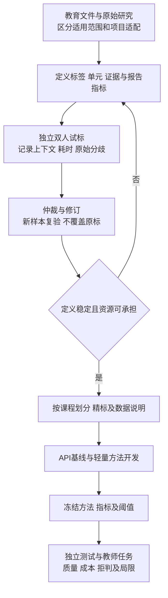

# 课镜教学反馈标注与评价规范

整理日期：2026年9月15日。状态：可用于试标的项目规范，尚未经试标验证。适用范围：自有平台内获准用于研究的中文录播课程反馈。本文规定数据与报告如何判断，不提供课程总分、认证等级或学生掌握率。

## 1 权威依据及适用边界

教育部2015年在线开放课程建设文件支持课程建设、应用与服务质量的关注范围[S1]；2022年文件针对高校用以认定学分的在线开放课程教学管理[S2]，不能将其中所有要求直接认定为本研究原型的适用义务。Quality Matters第七版强调目标、评价、材料、活动和技术之间的协调[S3]，其认证体系不等于本项目的自动评分方法。课镜仅借鉴公开维度，不复制受限注释，不声称获得QM认证。

EduRABSA将教学评价对象和倾向分别处理，为混合评价提供参考[S4]。课镜的六类表达标签是适配教师复盘任务的项目定义，尚无证据表明它们是政府规定或唯一科学分类。标注一致性方法依据Artstein与Poesio的综述[S5]；数据来源与适用人群说明依据Data Statements[S6]；报告引用评价借鉴ALCE对引用支持的研究[S7]。2026年的一致性指标综述作为近期补充，按预印本看待[S8]。

本文的示例、流程、样本安排和验收决策均为项目设计，不是上述文件规定的统一阈值。引用支持证明材料与主张之间的关系，不能证明课程有效促进学习。

## 2 标注对象与查看材料

原始弹幕为基本记录；表达标签可多选。问题单元是原文中可辨识的一个信息需求，一条记录可含多个单元。教学片段为课程内容单位，不能由弹幕长度决定。报告主张是可独立核查的一个事实或解释，多项判断应拆开评价。

采用两遍标注。第一遍仅查看弹幕及必要的课程标题，标注原文表达、问题短语和不确定性；第二遍查看预先规定的转写、画面或音频，补充指代对象及讲解关联，保留第一遍结果。禁止通过课程内容替学生补写未表达的问题。记录实际看过的材料及区间，保证不同模型与标注者可比较。

时间候选以播放位置为起点向前召回，初始试标可采用前120秒至后30秒；这是待校准的项目参数，不是已验证的发言延迟分布。若扩大范围，保存扩大原因和区间。模型比较要么使用相同候选范围，要么将范围变化作为独立实验因素。

原文保留原始文本，清洗文本另存。字符边界按Unicode码点计数，采用左闭右开区间，并记录对应原文短语。表情、标点和全半角转换不能悄悄改变原文位置映射。

## 3 逐条判定顺序

先判断相关性为教学相关、非教学相关、无法判断；再对相关或暂不能排除的记录标六类表达与原文依据。不得先删除疑难记录再评价模型。接着标记评价或情绪倾向、提取问题单元、核查上下文、判断归并与定位，最后由另一标注者独立处理。

| 标签 | 纳入条件 | 排除或边界 | 合成示例 |
|---|---|---|---|
| 问题与求助 | 请求解释、确认、解答，或明确提出未理解并求助 | 纯情绪词不自动视为问题；疑问句形式不是必要条件 | 这一步没懂，请再讲一下 |
| 知识交流 | 提供与知识有关的回答、推导、补充、纠错或讨论 | 不预先认定内容正确；单纯请求解释归入求助 | 此处还要满足x不等于零 |
| 理解自述 | 明确陈述自己的理解或未理解体验 | 不推断真实能力；未理解且请求帮助可同时标求助 | 终于明白为什么换元了 |
| 学习情绪 | 明确表达学习情境中的情绪或体验 | 不作心理诊断；难度评价未必是情绪 | 急死我了，跟不上 |
| 教学评价 | 对讲解、例题、节奏、音画等表达评价 | 只说懂了不自动推断对教师的评价 | 这个例子讲得很清楚 |
| 改进建议 | 对教学安排或呈现提出可辨认的改变请求 | 单纯负面评价不自动生成建议；有求助可多选 | 建议把适用条件留在屏幕上 |

倾向独立记录：积极、消极、混合、中性、无法判断、不适用。优先绑定具体评价对象或情绪短语；同条出现“例题清楚但讲得太快”分别标例题积极与节奏消极，不用单个正负值抹掉差异。知识回答没有评价时用不适用。反讽需要上下文证据，证据不足用无法判断。

“太难了”可为难度体验，未提出求助时不制造问题；“没懂”标理解自述，结合上下文决定是否确有求助，无法判断时保留待核；“没懂，再讲一下”同时标理解自述及笼统求助。所有符合定义的笼统求助进入问题清单。“谢谢”仅有礼貌表达时，不直接推断知识理解或教学效果。重复文本保留独立原记录标识，另标近重复关系，不能假定来自不同人或删除后仍宣称完整覆盖。

另设“困惑表达、未理解自述、显式求助”字段，允许共存与无法判断。所有已识别困惑均保留在可筛选清单中；仅满足问题单元定义的内容计入问题识别分母。不能为增加召回将纯宣泄全部算作问题，也不能因其未构成问题而从报告中删除。

## 4 问题、归并与片段标注

每个问题记录原文位置、具体或笼统类型、所问对象、条件、否定、上下文补充及补充来源。“为什么能约掉x，x等于零怎么办”拆成约分依据和零值情形，两个单元共同引用原记录。“这里不懂，求再讲一遍”保留笼统求助，不扩写成某个数学问题。

同义归并须满足信息需求一致。对象、条件、否定、所求内容任一实质不同，则保留不同单元，可放同一主题但不当作一个问题。建立问题单元到问题簇的完整映射；簇摘要不能代替原单元。若一条摘要覆盖多个单元，逐项记录被覆盖的条件。

片段标注记录一个或多个可支持关联的区间、对应转写或帧及理由。状态为已定位、多候选、未定位、无可用材料。时间相邻不能单独作为语义支持；画面变化只作分界线索。两名标注者先独立选择，再核查分歧；合理的多个关联保留为有效候选，不强行选唯一片段；教师或有相应学科背景者审核数学条件与推导争议。

## 5 教学观察的判定标准

五方面为项目适配维度，需在试标与教师试用中检查是否覆盖主要反馈。每项观察记录“反馈事实、材料观察、解释、建议”四层，不能将它们合并成确定性判断。建议分为保留、补充、调整、待核，不按反馈负面比例生成等级。

| 观察维度 | 可核查问题 | 最低证据 | 不能据此断言 |
|---|---|---|---|
| 概念与条件 | 定义、符号及适用条件是否在相关范围出现 | 问题原文与对应讲解或画面 | 全课缺失或学生已掌握 |
| 推理衔接 | 学生所问的推导过渡有何材料支持 | 相邻步骤及具体问题 | 有困惑即推理错误 |
| 例题方法 | 例题是否回应具体方法疑问或获明确肯定 | 例题片段及针对性反馈 | 点赞多即方法最优 |
| 结构节奏 | 何处出现跟不上、重复请求或节奏肯定 | 播放位置分布、原文和片段范围 | 实际缓冲、回看或所有学生体验 |
| 音画资料 | 声音、字幕、画面是否可辨且与讲解对应 | 实际媒体检查与反馈 | 仅据抱怨确定技术故障 |

明确肯定与改进意见使用相同证据要求。大纲仅用于判断目标与材料对应；目标达成需额外测验设计。缺少大纲时标未提供，不判课程不合格；没有反馈时标无观察依据，不判教学优良。

## 6 标注组织与质量控制

先用少量合成例子培训，之后对200—300条自然反馈开展独立双标。按课程和播放区间抽样，保留自然分布；补充难例单独统计。完成第一轮后计算仲裁前一致性、查看各类分歧，修订规范，再用一批未见记录验证。不能反复讨论同一批后宣称独立一致性提高。

标注者记录匿名编号、学科背景、培训内容及每条耗时。试标和测试集不显示模型建议；若训练集使用预标注，则标记辅助来源和人工修改，避免将模型输出当独立标准答案。仲裁保留双方原标、分歧类型、结论和规范条款，不能覆盖原标后再计算一致性。

分歧区分操作或知识错误、规范缺陷、合理语义多解：分别纠正、修订后重新独立验证、保留标签集合或歧义状态。学科审核核查推导与材料支持，不能替学生裁定唯一情绪。测试同时报告明确样本与歧义样本表现，不将歧义样本静默排除。此处理借鉴Human Label Variation[S9]，并非要求所有任务放弃确定标签。

固定单位上的六类标签分别计算二元Cohen kappa并同时报告原始一致率、标签频数及混淆表；类别极少或单一时解释不稳定或不可计算，不填零掩盖原因。两人以外或存在缺失标注时可采用明确距离函数的Krippendorff alpha，但要说明单位和缺失处理。问题短语另报精确边界与字符重叠F1；片段区间另报重叠和人工关联一致性，不能将不同类型直接混成一个总系数。[S5、S8]

本项目不把0.8等经验数字包装成通用合格线。试标后由团队与导师按错误风险确定最低可接受条件，并在正式标注前记录。核心求助标签持续分歧、条件定义未稳定或学科争议未解决时，不启动大规模训练标注。

约三万条为自然数据积累目标。若每条每人30—60秒，三万条双标约500—1000人时，尚未计入仲裁和媒体核查。先测真实耗时；预算不足时保留候选原始资料，缩小精标集，优先保证独立测试质量，不将未精标记录称为高质量标注集。

## 7 模型与报告评价方案

主研究聚焦较低推理成本下的问题识别与关键条件保留。主要质量指标为问题单元F1，条件保留为关键约束；六类标签、摘要、定位和引用为次要指标。多个次要结果不得择优替代主结果。评价单位、主要指标与成本记录在测试前冻结。按课程划分训练、开发、测试；同一课程剪辑和近重复材料放同一集合。只有三个视频时可作探索性按课验证，不能充分支持跨课程泛化；应增加独立课程。类别抽样测试与自然分布测试分开报告。

| 对象 | 指标定义 | 说明 |
|---|---|---|
| 六类多标签 | 每类P=TP/(TP+FP)，R=TP/(TP+FN)，F1=2PR/(P+R) | 同报宏平均、微平均、每类支持数；零分母报告处理规则 |
| 问题识别 | 与人工问题单元一对一匹配后的精确率、召回率及F1 | 匹配规则先在开发集确定；笼统求助单列；重复输出不重复计对 |
| 条件保留 | 正确保留的必要条件项/人工定义必要条件项 | 条件来自人工真值，不能仅评价模型自己提取的条件 |
| 问题覆盖 | 摘要涵盖的不同人工信息需求/全部人工信息需求 | 固定摘要字数；完整清单覆盖与摘要覆盖分别测 |
| 归并错误 | 含非等价问题的簇数/被评价簇数 | 另报受影响问题单元比例，防止簇大小掩盖损害 |
| 片段检索 | Recall@k及区间IoU | k、区间匹配规则预先固定；多答案真值允许多个有效片段 |
| 引用有效性 | 能访问对应材料的引用数/全部引用数 | 工程指标，不能代替语义支持 |
| 引用支持 | 被所引材料充分支持的主张数/需证据的主张总数 | 逐主张检查，漏引计入分母；部分支持及矛盾单列 |
| 拒判 | 待核或拒判记录数/全部有效输入数 | 同报自动处理覆盖率和处理部分的错误率 |
| 效率 | 端到端时延、峰值内存或显存、令牌及费用、复核时间 | 同输入同范围，冷缓存与缓存命中分开，API辅助比例单列 |

ALCE支持将引用质量独立评价[S7]；上述课堂主张判定和指标分母是本项目适配，需人工验证。每个报告应保存实际处理范围、未处理数及证据不足数，不能删掉难例提高平均成绩。

主要比较使用同时获准用于本地和指定API接收方处理的同一交集快照，视频和大纲也核对相应处理范围；不得强迫同意外部处理。许可范围不同的数据只在各自范围分析，不能混作配对比较。

先固定转写、画面和候选片段开展组件比较，再开展完整系统比较，分别归因。增加规则或线性分类、时间邻近、检索及“摘要加完整清单”等简单基线；模型对照为通用API、普通小模型、专用小模型、小模型加可选API。使用同样输入、报告预算和测试集，记录提供方模型标识与运行日期。检索、量化、提示、训练分别做组件对照。拟检验“关键质量差异在可接受范围内且资源下降”；差异界限在开发阶段由教师任务风险和试点确定。若要正式声称非劣效，应预先设定界限、样本量和统计方案，不能凭差异不显著得出能力相同。

各方法使用相同开发材料与预先记录的调优预算，API提示应合理调优。词表、阈值、提示示例和增强策略仅用训练及开发材料确定；同原片剪辑归组，记录同教师与系列课程关系，跨教师结论另需未见教师测试。训练随机种子与运行版本留档。推理成本和训练、存储、运维总成本分开报告，本地运行不等于零成本。

课程级报告结果，不把同课数万条当独立课程样本。置信区间以课程聚类为基础；课程极少时重点报告逐课数值及限制，避免不稳定区间制造确定感。固定测试评价后若据结果继续调参，新增验证集承担下一轮确认，旧测试转为开发证据。

## 8 教师研究与数据治理

先邀请3—5名教师或助教做形成性试用，再根据实际招募与试点效应规划正式任务研究；8—12人只是当前招募设想，不是已证明有统计能力的样本量。相同原材料、匹配难度、平衡顺序，比较固定时间内有依据的问题和亮点发现、错误采纳及核查耗时。说明评分者、盲法可行范围、任务说明与退出方式。独立学科评分者按证据规则评价发现是否成立，满意度另报；同一教师的重复任务不是独立教师样本。界面与材料尽量一致，并控制前序任务的记忆影响。

每批数据附数据说明：来源、课程主题、材料取得时间、抽样方式、实际范围、课程数与参与者数、标注者背景、许可范围、清洗与缺失、已知偏差、划分方案及禁用场景[S6]。不为填表额外收集不必要的敏感人口信息。

原数据、标注副本和报告按权限分离。研究使用、外部API处理、训练及公开发布分别核对范围；获准推理不自动包含蒸馏训练权限。具体保存期限和撤回派生材料清理期限需在真实招募前与导师及学校流程确定；未确定时不开展新一轮正式参与者采集。记录的标注规范版本或摘要仅用于复现，不生成无用重复申报稿。

## 9 阶段准入与未完成事项

前期增加四项交付：本规范试标修订、含分歧的试标报告、数据说明、API基线评价记录。通过独立新样本验证定义可操作后再扩大标注。中期在标注质控和课程划分完成后训练轻量模型，独立测试前冻结主要指标与阈值；后期在教师效用和跨课程结果成立后推进部署。

尚未完成：真实双标、一致性数值、独立课程落实、质量差异界限、正式教师实验样本量、数据保留及撤回期限、学科审核人员落实。本文件补齐操作定义与方法依据，没有将这些待验证项改写为已解决。

## 10 可追溯资料

- [S1 教育部2015年在线开放课程建设意见](https://www.moe.gov.cn/srcsite/A08/s7056/201504/t20150416_189454.html)：上层课程建设方向，非弹幕评分量表。
- [S2 教育部等五部门2022年教学管理意见](https://www.moe.gov.cn/srcsite/A08/s7056/202204/t20220401_612700.html)：学分课程管理场景，适用范围需区分。
- [S3 Quality Matters Higher Education Rubric 第七版](https://www.qualitymatters.org/qa-resources/rubric-standards/higher-ed-rubric)：目标与材料等协调；公开页面说明版本更新不改变底层标准应用。
- [S4 Hua等 EduRABSA 2025](https://arxiv.org/html/2508.17008v1)：教育评价方面与倾向拆分；本次采用预印本，非中文弹幕六类认证。
- [S5 Artstein与Poesio 2008 Inter-Coder Agreement](https://aclanthology.org/J08-4004.pdf)：一致性指标假设及任务差异。
- [S6 Bender与Friedman 2018 Data Statements](https://aclanthology.org/Q18-1041/)：数据背景、适用范围与偏差说明。
- [S7 Gao等 2023 ALCE](https://aclanthology.org/2023.emnlp-main.398/)：生成文本的引用评价。
- [S8 Counting on Consensus 2026](https://arxiv.org/abs/2603.06865)：近期一致性指标选择预印本，用于补充，不能代替本项目试标验证。

- [S9 Plank 2022 Human Label Variation](https://aclanthology.org/2022.emnlp-main.731/)：合理语义分歧与不确定性保留。

研究主次关系与完整对照设计见《项目严格评审与研究实施方案》（仓库 docs/research-review.md）。
