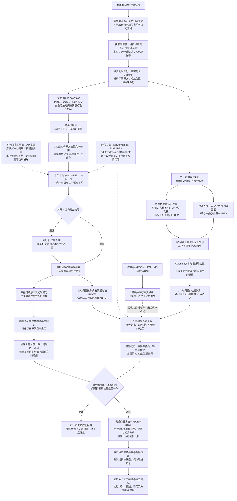

> 当前入口已改为课镜自有课程平台，先注册登录并上传课程，从课程进入教师工作台。新的平台及音视频流程见[平台说明](platform.md)和[独立音视频模块](course-av.md)。下文保留原有处理能力或历史验证，适用范围以新流程为准。

# 立项试验Demo实际调用链

模型初步分析尚需人工验证，是否完成以当次state.json为准。

```mermaid
flowchart TB
  U["教师输入B站视频链接"] --> L["需要时在官方页面扫码登录<br/>本机会话用于取得当前可访问素材"]
  L --> A["获取元信息、当前弹幕快照、带音轨视频<br/>本次：54分钟整课；7200条弹幕"]
  A --> V["校验视频身份、真实时长、文件散列<br/>解析弹幕原文与播放位置，保留来源行"]
  V --> RANGE["本次选择00:00–05:00<br/>范围内4943条，262种原文<br/>去重后按时间等间隔选取100条"]
  RANGE --> C["一、弹幕证据库<br/>c编号＋原文＋毫秒时间戳"]
  V --> M["二、本地媒体处理<br/>faster-whisper与视频取帧"]
  M --> S["整课1506段转写草稿<br/>只纳入完整落在前5分钟的句段<br/>s编号＋起止时间＋原文"]
  M --> F["整课28张；前5分钟3张课堂画面<br/>f编号＋播放位置＋JPEG"]
  PROFILE["可选择推理服务：API主要方式／本地离线／校园服务器<br/>本次仅验证本地；远程未配置不自动发送"] -.-> Q
    C --> D["100条抽样原文进行文本分类<br/>各条原始记录与时间仍分别保存"]
    D --> Q["本次本地Qwen3.5-4B，48条一批<br/>六类＋积极表达＋语义不明"]
    Q --> G{"序号与结构覆盖校验"}
    G -->|遗漏| R["缩小批次补处理<br/>单条仍失败则明确标为待处理"]
    R --> H["映射回100条抽样弹幕<br/>显式疑问规则另行补查"]
    G -->|覆盖| H
    H --> I["保存问题原文及问题编号<br/>相同问题仅合并空白差异"]
    I --> J["模型逐问题生成概述与主题词<br/>词必须在原问题中出现"]
    J --> K["程序复算分类计数、问题数、词频<br/>建立主题词到全部问题原文的链接"]
    S --> W["每5分钟汇集该窗全部转写<br/>从已有画面中选取1张"]
    F --> W
    W --> X["Qwen3.5文本与视觉联合推理<br/>生成主题标题及带s或f引用的概述"]
    X --> Y["1个时间窗的主题索引<br/>不等同于已验证的知识点边界"]
  T["教师导入DOCX、TXT、MD或粘贴大纲"] --> O["提取并保存原文段落<br/>o编号＋原文＋文件散列"]
  H --> E["每时间窗选取代表问题与积极反馈<br/>综合输入选取范围单独记录"]
  Y --> Z["三、所选模型综合复盘<br/>教学安排、实际讲解与反馈的对应"]
  E --> Z
  O -."提供大纲时参与；未提供不虚构".-> Z
  Z --> P["整体概述、值得保留处、待核查建议<br/>每项附c、k或o证据编号"]
  P --> B{"引用编号属于本次材料<br/>问题列表和统计数量一致"}
  K --> B
  B -->|无效| ERR["本轮不发布成功报告<br/>保留缓存与失败原因，修复后继续"]
  B -->|通过| OUT["课镜交互报告＋JSON＋HTML<br/>标明100条抽样试用、范围与初步分析<br/>不估计课程反馈比例"]
  OUT --> TE["教师点击单条弹幕与视频位置<br/>确认或排除线索，保存改进记录"]
  TE --> RES["立项后：人工标注与独立测试<br/>检验识别、概述、引用及教师复盘效用"]
  REF["研究依据：CoKnowledge、EduRABSA<br/>EduFeedback-RAG与ALCE<br/>用于设计借鉴，不代替本项目实测"] -.-> Q
  REF -.-> Z
```
