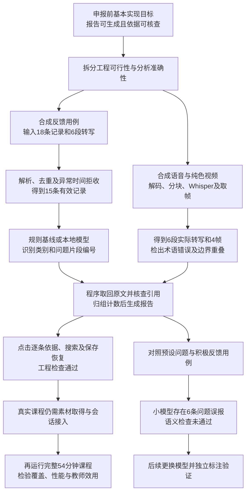

> 当前入口已改为课镜自有课程平台，先注册登录并上传课程，从课程进入教师工作台。新的平台及音视频流程见[平台说明](platform.md)和[独立音视频模块](course-av.md)。下文保留原有处理能力或历史验证，适用范围以新流程为准。

> 当前验收已改为前五分钟内100条真实弹幕的完整闭环，见[当前流程](demo-flow.md)及[运行方式](inference-modes.md)。下述全课覆盖属于后续扩大验证范围。

# 基本Demo实践记录

日期：2026年9月14日。本文记录合成反馈与音视频、模型联合试验。随后已完成指定B站课程的真实数据获取，详见[真实获取试验](real-acquisition.md)。真实课程分析仍未完成，合成检查数字不能作为真实网课分析性能或教学效用结论。

## 问题与设计依据

保留问题与原文的关系借鉴项目既有CoKnowledge、EduRABSA及有据摘要研究设计。当前仅实现原文片段选择与精确文本归组，尚未实现这些研究的完整算法或复现实验。权威教育依据规定解释边界，不能代替本次模型准确性检验。

## 实际执行结果

| 检验对象 | 输入与操作 | 实际结果及含义 |
|---|---|---|
| 导入与报告 | 18条合成记录、6段人工编写的合成转写，配置54分钟时间范围 | 有效15条、重复请求1条、异常时间2条；规则模式得到10个问题单元、9组问题。只是时间范围覆盖的功能演示，未处理54分钟真实视频 |
| 浏览器交互 | 点击类别、全部弹幕、问题搜索及原文按钮，保存教师记录后刷新 | 15条证据可查看；搜索与原文对应；保存恢复成功；修复分钟柱图窄屏溢出后无横向溢出 |
| 本地语音推理 | Windows系统合成中文讲解18.572698秒，Whisper tiny CPU int8，10秒分块 | 实际推理约1.535秒，得到6段转写；该耗时不能外推54分钟高数课程性能 |
| 音视频处理 | 合成语音配纯色测试画面，解码时长25秒，10秒分块、7秒取帧 | 3个分块完成，输出6段转写及4帧。最后一块无语音文本，状态仍被明确记录；重复运行复用了3个成功分块 |
| 分块时间核查 | 检查输出片段边界 | 检出1对重叠片段，约9秒附近存在重复讲解内容，已输出待核记录，边界策略尚需改进 |
| 本地文本模型 | Qwen3-0.6B Q8_0，llama.cpp b10951，15条有效合成反馈 | 15次真实调用完成，报告生成约18.686秒；预测15条均含问题，预设用例实际9条含问题，产生6条误报并漏识别1条积极反馈，未通过语义检查 |
| 联合链路 | 使用实际ASR转写、4帧与重新定位时间的15条合成反馈，再调用本地模型 | 完成15次调用，约17.131秒生成含16个问题单元的报告；原文可追溯，但重复上述语义错误，结果仅供调试 |
| 自动检查 | 9个单元测试及浏览器交互检查 | 当前检查通过，覆盖记录去重、时间边界、求助保留、纯情绪、输入格式、引用、计数与链接范围 |
| 指定B站课程 | BV1Y2DGYoEEw，用户已确认播放器可播放 | 本轮未运行真实采集；未获得课程媒体或弹幕，未验证54分钟真实课程端到端 |

## 发现的问题与已作调整

第一次模型请求允许直接生成问题文字，出现原文引用校验失败；改为只能选择输入片段编号，原文由程序取回。批量输出仍出现编号遗漏或重复，因此最小模型试验改为每次一条、结构化约束输出，并保留每次请求与响应计数。程序不将结构错误静默替换为成功。

这些调整解决输出结构与溯源问题，未解决语义误报。小模型把“老师讲得很清楚，谢谢”和“崩溃了”等识别为提问，说明需要更合适的模型及独立验证。规则基线通过当前预设用例，但规则与用例均由开发者编写，也不能据此宣称研究准确率。

Whisper tiny将“导数”识别为“導樹”等，说明数学术语与分块边界需要进一步处理。暂不把此模型作为正式高数转写方案；后续比较更大中文转写模型，加入术语提示、画面公式证据并核查边界。当前纯色视频只检验取帧文件与时间链路，不检验视觉识别。

## 一键入口的真实状态

已经实现链接输入首页、后台串行任务、采集连接器、转写与报告调用及进度查询。后台只接受B站完整BV地址，保留指定分P。已配置模型服务时仍需有真实素材取得与处理记录；其存在不等于自动证明许可。

“打开课程并登录B站”目前只是打开官方网页，尚未自动传递会话。后台支持主动提供的本地会话文件，未读取应用浏览器凭证。自动登录回调、登录失效恢复和平台弹幕分片完整性未实现。不能声称任意链接已能一键分析。

## 试验逻辑

## 本地证据与来源

仓库`outputs/synthetic-demo`保存导入与报告结果，`outputs/media-smoke`保存合成语音、视频、ASR与取帧及联合报告，`outputs/model-demo`保存文本模型请求响应、语义检查和报告。所有生成数据与模型权重均被Git忽略；源码、合成输入、运行说明和当前试验说明保留在仓库。

语音实现依据：[faster-whisper官方仓库](https://github.com/SYSTRAN/faster-whisper)，本地模型为Systran/faster-whisper-tiny固定提交`d90ca5fe260221311c53c58e660288d3deb8d356`。文本模型来自[Qwen官方GGUF仓库](https://huggingface.co/Qwen/Qwen3-0.6B-GGUF)，固定提交`23749fefcc72300e3a2ad315e1317431b06b590a`。llama.cpp使用官方b10951 Windows CPU发行包，下载SHA256与官方资产摘要一致。具体文件校验值见`docs/local-runtime-manifest.json`。

下一阶段的完成条件是取得允许处理的真实输入，验证登录会话接入，更换不合格的小模型，并对真实课程产生可核查报告。当前没有论文性能结论、教学质量等级或学习掌握率结果。
