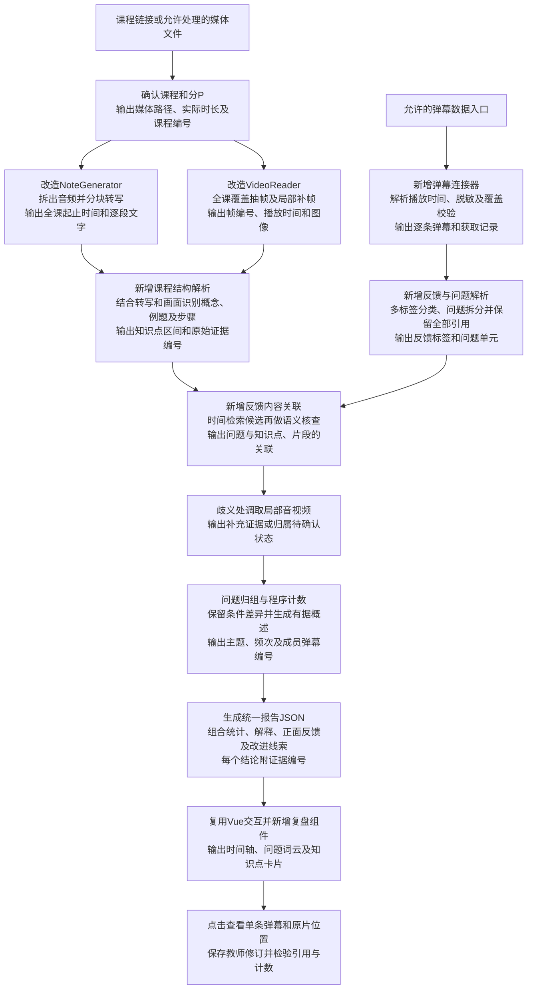

# FrameScope源码核验与接入方案

核验日期：2026年9月14日。仓库：https://github.com/chaojixinren/FrameScope 。固定提交：`90261750b0b812d692e51220d01d35d1020c2b58`。本次完成源码静态阅读，未安装运行该项目、调用模型或取得试验视频。Git克隆连接失败后，通过GitHub官方原始文件入口保存选定源码；这是一份核验快照，排除了环境文件、数据库、截图及测试文件，不是完整可运行副本。

## 已确认的实际能力

`python/app/services/note.py`的`NoteGenerator.generate()`依次取得媒体、转写、生成笔记、处理截图链接、保存状态，返回`NoteResult(markdown, transcript, audio_meta)`。本项目应在这个结构化返回层接入，保留转写片段，不只接最终Markdown。

`python/app/models/transcriber_model.py`定义每段`start/end/text`，时间单位为秒。适配到本项目时换算为毫秒并增加课程、分P、片段编号。`python/app/transcriber/groq.py`以`verbose_json`请求转写，读取返回segments。`note.py`初始化时强制使用Groq，因此依赖表包含faster-whisper也不能证明本地转写已经可用。

`python/app/downloaders/bilibili_downloader.py`已有基于yt-dlp的音频与视频下载代码；已读配置没有显式Cookie接入。本地下载器不自动继承应用浏览器登录状态。是否能处理目标链接仍需真实测试，源码存在不能证明当前平台请求一定成功。

`python/agent/graphs/node/note_generation_node.py`设置`video_understanding=True`、`grid_size=None`、`video_interval=0`。结合`note.py`可知该路径下载视频但跳过拼图生成。`universal_gpt.py`能组装图像消息，`video_reader.py`能抽帧和拼图；能力代码存在，但默认节点未启用该视觉输入流程。

`trace_node.py`从总结提取Content时间标记，再定位媒体并截图，返回原片与图片映射。它支持报告溯源交互，但截图出现不能证明结论经过图像理解。缺少视频索引时按转写时间匹配，最终可能回退第一条视频，后续应以明确课程及片段编号代替此类推测。

本次选定Python源码检索中，弹幕相关代码仅见`video_tools.py`读取搜索结果的弹幕数量，未发现逐条正文与播放时间采集、问题提取、教师复盘分析的实现。

## 完整54分钟试跑必须处理的问题

Groq转写实现超过18MiB时仅压缩为64kbps，随后整文件上传，没有在该实现中发现分块、压缩后二次校验和全课时间偏移合并。54分钟音频按64kbps估算约25.9MB，即24.7MiB；这是容量估算，服务实际限制尚未核实。应改为可配置分块、独立状态及全课时间恢复，避免依赖一次长请求。

`VideoReader.extract_frames(max_frames=1000)`限制抽帧数量。如果启用默认每2秒抽帧，54分钟约需1620帧，1000帧上限会截断后段；`run()`还会跳过不足一整组的尾部拼图。新链路必须覆盖全课并保留尾组，通过画面变化和疑问位置控制取帧量，输出覆盖记录。上述为代码推导，尚无本视频测量结果。

需要独立的教师报告数据结构、弹幕引用与统计校验；原有跨视频总结不能直接承担教学反馈判定。模型选型应支持可替换服务，不能把原有外部供应商视为已经部署的开源权重模型。

## 具体接入与实现顺序

首先定义`CourseAsset`、`TranscriptSegment`、`FrameEvidence`、`DanmakuRecord`四种输入记录：课程身份和实际时长、带时间转写、带时间画面、逐条弹幕。媒体与弹幕导入共享同一课程和分P编号，原始文件与派生结果分别保存。

随后改造音视频入口，支持本地媒体，拆开下载、转写和总结任务；实现分块转写、失败续跑与明确片段编号。抽帧结果必须包含实际取帧时间；数学公式识别和课程结构整理作为新增步骤，保存不确定内容。

并行建立弹幕连接器，支持允许的在线取得方式和文件导入。统一播放时间、记录获取区间和失败状态，按来源记录编号识别重复请求，保留不同记录的相同文本。当前没有核实目标视频分片接口与实际返回量，不能声称一键采集已实现。

分析时先用播放时间筛选讲解候选，再结合问题中的概念和条件关联知识点；歧义处调用局部画面和转写复核。六类反馈允许多标签，所有已识别问题保留原文引用，归组保留条件差异和低频问题。纯情绪表达与具体、笼统求助分别记录。

最后将程序统计、问题主题、有据解释和媒体索引汇总为报告JSON，前端由同一份数据生成时间轴、知识点卡片、问题词云及逐条证据抽屉。教师修订单独保存，避免覆盖模型初始结果。输出成功和准确性评价分别报告。

## 来源与复用条件

上述文件见[上游固定提交](https://github.com/chaojixinren/FrameScope/tree/90261750b0b812d692e51220d01d35d1020c2b58)，可依据固定提交核对GitHub原文。本次仓库树中未发现LICENSE、COPYING或NOTICE文件；需要确认代码权利人与可修改、分发范围后开展实际复制集成。公开仓库的可读性不能单独确定复用许可。仓库树含环境配置和数据库运行文件，本次未读取或采用其中凭证和历史数据；后续部署使用本项目独立配置。

当前完成度：源码静态核验与接入设计。未完成：完整安装启动、模型配置、真实媒体与弹幕取得、完整课程处理及报告准确性验证。

