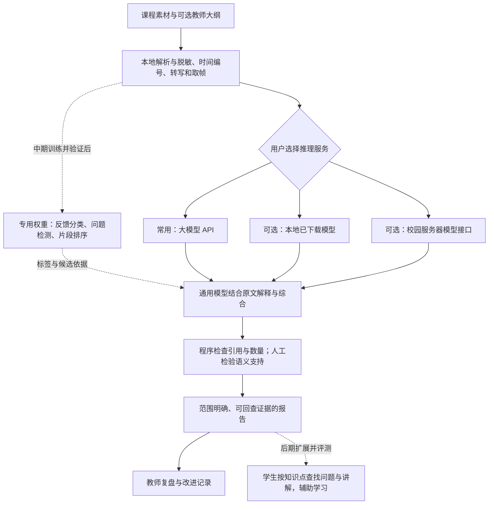

> 当前入口已改为课镜自有课程平台，先注册登录并上传课程，从课程进入教师工作台。新的平台及音视频流程见[平台说明](platform.md)和[独立音视频模块](course-av.md)。下文保留原有处理能力或历史验证，适用范围以新流程为准。

# 课镜模型运行方式与校园部署

课镜面向教师课程复盘，并逐步发展为面向在校师生、由校园服务器支持的日常便捷教学辅学工具。当前实测覆盖教师复盘流程。学生端的个性化辅学、身份管理与校园部署尚未实测，不由教师报告的完成推定已经实现。

## 当前实现

前端的运行方式默认为大模型 API，可切换离线本地分析或校园服务器。三种方式调用同一条证据处理链，均保留原文编号、问题清单和引用校验。离线指已取得素材后的分析阶段；登录与获取 B 站素材仍需联网。本地语音转写与取帧先生成材料，所选服务负责弹幕分类、讲解概述、问题概述及综合复盘。

API 与校园服务采用兼容 `/v1/chat/completions` 的接口，音视频模式需要支持图片输入，并支持 JSON 输出或 JSON Schema 结构输出；返回结果均在本地再次校验结构。只提供文本能力的服务暂不满足音视频模式要求。服务实现差异需要实际联调，配置成功不等于模型调用成功。真实课程闭环试验使用本地 Qwen3.5-4B；百炼已完成174项模型目录查询与 qwen-plus 单条合成文本调用，尚未验证远程视觉及课程完整报告。

API 方式优先在前端“模型连接设置”填写厂商、官方地址、Key 与模型；Key 仅存在当前后端进程内存，重启后清除。也支持服务管理员在启动后端前配置环境变量。`COURSE_API_BASE_URL` 填含 `/v1` 的 HTTPS 地址，`COURSE_API_MODEL` 填服务实际模型名，`COURSE_API_KEY` 填密钥。校园入口标为【待真实接入测试】，本次不进行真实接入。校园方式使用同名的 `COURSE_CAMPUS_` 前缀。密钥只由后端读取，不返回浏览器，不写入分析缓存。默认不调用远程服务；用户选择对应模式并发起分析后，才向已配置服务发送材料。配置缺失或调用失败会停止并记录原因，不自动换服务。

发送内容包括脱敏后的弹幕、转写、抽样画面及用户导入的大纲；画面与大纲仍可能包含身份或未公开教学信息，校园部署须在数据授权范围内配置服务。当前后端只监听本机地址，不能直接改监听地址就作为校园多用户服务投用。

## 标注与专用权重如何补充通用模型

前期通过通用模型跑通输入、分类、问题归纳、证据回查和报告。中期在三门课程各约一万条弹幕上建立人工参照，区分纯情绪、具体提问、理解自述和教学建议，保留否定、公式条件与时间语境。训练集、开发集和测试集按课程及近重复文本隔离，避免同一句进入训练与测试后高估效果。

专用权重优先承担有明确人工标签的弹幕多标签分类、问题检测与候选片段排序。通用 API 模型负责跨材料解释和报告表达。专用模型给出标签、置信度和候选依据，通用模型只能依据这些记录及原文进行综合，不能把置信度直接写成课程质量分。意见不一致或低置信度时保留待复核标记。

当前没有已训练的专用权重，因此界面明确标记尚未参与评价。接入前需保存基础模型名称、权重散列、标签定义版本、训练数据授权说明和独立测试结果；通过与通用模型单独运行的对照后，再决定启用范围。不能把普通开源模型权重称为本项目训练成果。

## 校园投用条件与阶段目标

中期先在校园内受控试点部署模型服务，保留本地工作台调用入口，测量单任务延迟、每千条弹幕耗时、显存峰值、并发吞吐与失败恢复。增加校园统一登录、师生角色权限、课程隔离、任务队列、配额、材料删除及审计记录后，再开放多用户访问。部署不能默认公开他人的弹幕原始数据、课程媒体或教师大纲。

后期围绕教师复盘和学生按知识点检索两个具体任务验证日常使用效果。通过教师完成同一复盘任务的时间与发现线索质量、学生找到相应讲解的成功率与用时进行对照，依据结果决定推广规模。当前尚无校园服务可用性、成本优惠或学习效果结论。
