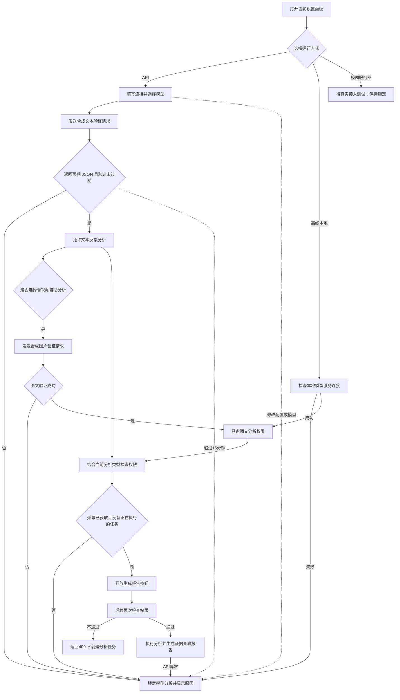

> 当前入口已改为课镜自有课程平台，先注册登录并上传课程，从课程进入教师工作台。新的平台及音视频流程见[平台说明](platform.md)和[独立音视频模块](course-av.md)。下文保留原有处理能力或历史验证，适用范围以新流程为准。

# 模型连接与操作开放逻辑

导航栏齿轮打开独立设置面板。大模型 API、离线本地与校园服务器均在该面板选择。主页面保留课程获取、分析范围和报告操作，连接正常时齿轮显示绿色；尚未验证、能力不足或连接异常时显示锁定状态及原因。

## 输入、判断与执行

API 验证许可绑定当前内存配置。刷新模型目录仅提供候选项，不授予推理权限。文本与图文许可分别检查；编辑未保存的连接也立即锁定前端按钮。前端每15秒读取后端状态，点击生成时重新读取，后端在创建任务及执行入口再次检查。近期探测成功无法保证下一次网络请求一定成功，因此执行失败仍须如实报告并撤销许可。

本地模式检查当前已部署的本地多模态服务是否在线。校园服务器按照当前试验安排保持【待真实接入测试】，即使填入环境配置也暂不开放分析。正在分析时禁止切换连接配置，避免任务使用的模型与页面选择混淆。

获取课程数据、查看已有报告和人工材料操作不依赖模型连接。最近一次分析失败时，仍可查看、导出上次成功报告，但页面与导出文件均显示明确提示，不将历史报告算作本次成功。Key 只保留在后端内存，服务重启后需要重新填写并验证。

## 代码与验证

前端入口为 `web/app.js` 的 `applyModelGate`、`modelActionAllowed` 与 `refreshModel`；后端公共判断位于 `src/model_access.py`，API 有效期与撤销位于 `src/api_settings.py`。`src/data_server.py` 在启动任务前拒绝无权限请求，`src/workbench.py` 在执行入口复核。

本次运行46项单元测试通过，其中新增7项覆盖保存配置不开放、文本与图文权限区分、换模型撤销、失败撤销、过期、本地掉线及校园锁定。页面实测 API 未验证时禁用、本地在线时开放、校园模式禁用；直接请求 API 与校园分析入口均返回409，任务状态文件未改变。失败后的历史报告提示也已在页面核对。

当前服务更新后未保存 API Key，需要用户重新验证。此前百炼合成文本探测成功，随后实际课程分析返回参数或能力不匹配错误，尚不能声称完整 API 分析已经跑通。本次调整未进行校园服务器试用。
