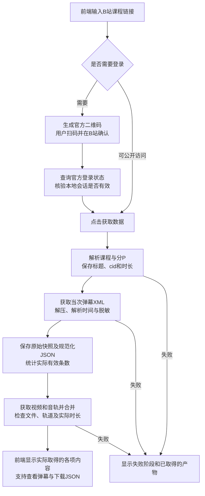

# B站真实数据获取试验

日期：2026年9月14日。目标课程`BV1Y2DGYoEEw`，P1，标题《“导数定义”不会做题？50min从入门到精通！｜高数上》。本次只要求取得运行当时可获取的弹幕快照，不追求平台全部历史。

## 实际结果

从当前前端点击“获取数据”，后台重新读取课程信息和弹幕，下载并合并音视频，再检查文件和时长，57.652秒完成。任务编号`d1150d3d51de4597b510077f7628a6ba`。本次未提供登录会话，说明该课程在本次请求条件下可直接获取，不代表所有课程或后续每次都不需要登录。

| 产物 | 实测内容 |
|---|---|
| 课程信息 | BV1Y2DGYoEEw，P1，cid 26637700429，接口时长3241秒 |
| 弹幕XML快照 | 678563字节，原始7200条，有效7200条，异常0条 |
| 播放时间 | 最早0毫秒，最晚3239838毫秒；这是记录范围，不能证明每个时间区间都有反馈 |
| 视频文件 | 113473708字节，1920×1080，包含音轨，解码时长3240.78585秒 |
| 页面验证 | 明确显示成功取得视频、课程信息和7200条带时间戳弹幕；可分页查看和下载规范化JSON |

弹幕SHA256：`dc3963b98681d18b72318228b06f4244b6e43205cd6fe8d53e4de882e85ab629`。

视频SHA256：`9445c53a5f11170041766f56c84847012f4572b2c50fd9a93ec96c947a6753c6`。

真实素材保存在仓库本机`outputs/jobs/d1150d3d51de4597b510077f7628a6ba/assets`，不提交GitHub。最初直接调用取得的素材位于`outputs/real-acquisition`；该目录重新核验记录的耗时只含校验，不能作为下载耗时。前端试验使用独立任务目录重新取得。

## 获取实现

前端`web/index.html`只提交课程链接；`data_server.py`核验来源、请求令牌、链接与分P后启动单个后台任务。`fetch_course.py`读取课程身份，取得当前XML快照、解析播放时间、脱敏并记录计数，再使用yt-dlp获取视频和音轨，由FFmpeg合并，PyAV确认媒体轨道与时长。每一步将状态原子写入`acquisition.json`，页面只展示已经通过检查的产物。

前端不要求模型配置，也不以本地文件存在代替真实许可。此前“必须先填写素材许可文件才允许技术请求”的程序门槛已从获取入口移除；来源、模型处理和发布条件仍需分别核对，不能将用户发起请求解释为平台书面许可。当前不自动上传真实数据到外部模型，不发布弹幕原文。

调试发现：基础HTTP客户端缺少适合接口的请求头时返回412；明确使用本项目名称`CourseFeedbackResearch/0.1`作为User-Agent并携带课程站点Referer后，同一公开元信息请求返回200。没有伪造浏览器身份或用户账号。弹幕响应采用raw deflate传输压缩，需要先按Content-Encoding解压，再按UTF-8解析；把压缩字节直接当文本会导致UnicodeDecodeError。两项失败已记录并在代码中修复。

视频接口返回独立音视频格式，直接要求已合并的`best`格式会失败。通过实际格式清单确认可用视频与音频后，下载并合并；失败、限流或访问限制不会被静默标成成功。

## 登录入口

点击“登录B站”后，后台向B站官方passport服务申请二维码，并在前端展示二维码及官方登录页面链接。当前官方返回的登录页面域名为`account.bilibili.com`；域名校验只接受这一域名及`passport.bilibili.com`。

用户在B站官方界面扫码确认后，后台查询官方登录状态，再通过`nav`返回的`isLogin`确认会话有效。只有两步确认成立才显示登录成功；不会把生成二维码、打开页面或扫码动作单独当作登录成功。已验证真实二维码生成和“未扫码”状态；本次尚未由用户完成扫码，因此登录后Cookie接续仍待真人验证。该分支另有模拟响应单元测试，不把模拟测试称为真人登录成功。

会话保留在本机进程内。实际获取任务需要会话时，仅为该任务创建本地临时会话文件，完成或失败后清除；不提交GitHub、不发送到模型。清除本地会话不表示注销B站账号，也不会登出用户原先的浏览器。服务器异常退出时可能留下临时文件，需要在恢复时清理；当前不作永久保存承诺。

## 流程

目前通过13项单元测试。真实获取成功只证明本课程当次数据链路可用；后续访问条件改变时仍可能失败。真实课程转写、分类、视觉核查及报告分析尚未完成。
