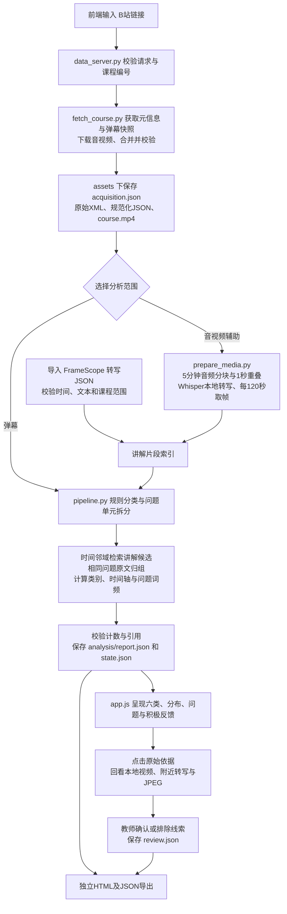

# 课程反馈工作台：运行与验证

当前入口为 `python src/serve_demo.py`，浏览器打开 `http://127.0.0.1:8766/`。依赖安装使用 `python -m pip install -r requirements-media.txt`。本机已具备依赖与 Whisper tiny 权重。

## 连续操作

输入课程链接，按需要通过官方二维码连接登录会话，点击“获取数据”。每次请求取得当次可用快照，记录实际数量、时间与媒体校验结果。已取得课程可以在素材区切换。

选择“弹幕快速分析”后，程序读取真实 XML、解析时间戳、执行六类多标签规则、保留问题单元、合并相同原文，计算时间分布和词云。没有转写时，报告明确展示上下文缺失。选择“结合音视频分析”后，程序先对完整本地课程进行分块转写与取帧，再把弹幕关联到播放位置附近的讲解候选。前端持续显示进度，不上传素材。

FrameScope 的 `TranscriptResult` 或包含 `transcript.segments` 的 JSON 可以通过导入按钮接入。必须含合法的 start、end、text；时间以秒计，且不得超过课程长度。当前借鉴 FrameScope 思路并兼容转写格式，没有把其无明确许可证的源码复制进本仓库。

复盘依次阅读重点时间窗、六类反馈、全课分布、问题概述与词云，再查看原始弹幕、候选讲解与画面。时间窗按含问题弹幕条数排序，属于回看优先级，不构成教学质量等级。默认图表为实际线性数量，压缩高峰开关采用 log(1+数量)，始终保留实际数量提示。

单条依据可以确认、排除或标为待核查，教师备注保存到本机项目。复核不覆盖原始分类，也不自动改变原统计；两者在导出 JSON 中分开保存。独立 HTML 包含弹幕、转写、交互查询及教师备注；不嵌入完整视频与画面文件，媒体联动保留在本机工作台。

## 实际验证

2026年9月14日，前端对 BV1Y2DGYoEEw 的完整 P1 课程完成本地处理。媒体实际时长3240.78585秒，课程接口时长3241秒，原始快照7200条。

完整音视频处理首次耗时135.912秒，其中媒体处理134.9秒；得到1506段转写、28张画面。规则修正后再次运行，复用11个已完成音频分块，重新取帧与生成报告耗时7.757秒，不能把该耗时当作首次转写性能。

当前报告保留7200条弹幕，标出281条含问题弹幕、288个问题单元和44条积极表达候选。问号连续出现作为一段表达保留，避免将“为什么？？？”人为计成三个问题。“听不懂了”“都听懂了吗”等明确否定或询问不再仅因包含“懂了”被标为积极。原文及具体、笼统求助仍保留。这些规则修正没有完成总体准确率验证。

17项原有及新增测试加1项语义回归测试共18项通过，覆盖导入计数、引用完整性、失败状态、转写兼容、脚本文本转义、否定与重复标点。真实接口验证包含：视频 Range 请求返回206及准确1000字节；JPEG画面可读取；导出HTML含完整数据且无未替换占位；JSON包含复核记录。结果数值见 `workbench-validation.json`。

浏览器验证了六类与积极反馈依据、完整处理入口、教师备注刷新恢复、本地视频定位00:32。临时保存测试备注随后已清空。手机宽度测试未发现横向溢出，并检查了实际截图。新界面采用用户提供的夜航玻璃风格：深墨底与三处柔光、无色低透明面板、40/60px模糊与180%饱和度、方向阴影、2.5%噪点、香槟金重点及减少动效模式。

## 调用与文件

`src/workbench.py`组织后台分析，前端不会自己虚构处理结果。`src/data_server.py`提供进度、报告、媒体分段读取、FrameScope导入和复核存储接口。`web/index.html`、`web/app.js`、`web/style.css`分别负责结构、交互和样式。失败时状态转为failed，不允许读取前一次成功报告充当本次结果；服务重启时将未结束分析标为中断。

## 当前限制与升级位置

Whisper tiny 可以跑通完整音频，但高数术语存在明显错误，例如开头将“导数定义”识别为“倒出电影”，以及多处公式混淆。1506段是转写片段数，不能称作1506个知识点。换用更强本地转写权重可通过环境变量 `COURSE_ASR_MODEL`指定含model.bin的目录，仍需用人工转写样本测字错率与公式正确率。

六类解析仍是规则基线；词云基于预设高数术语，相同原文合并不等于语义聚类。当前画面只供人看，尚未执行OCR、视觉大模型解释、内容语义章节识别、自动建议生成或强模型精调。既有 `course_feedback/models.py` 的模型适配器仍供独立试验，当前工作台没有默认调用已知效果不足的0.6B模型。真实流程的完成不表示这些研究功能或教育有效性验证已完成。

登录二维码生成已验证，真人扫码后会话传递仍需要由用户实际登录验证。素材、登录文件与报告原文都保留本机，不提交GitHub。

## B站连接与账号信息

工作台单独展示本机连接状态，包括未连接、等待扫码、等待官方确认、已验证连接、二维码过期、会话未登录或失效、验证暂不可用。昵称、UID和等级只从官方nav验证成功后的响应提取，不显示余额、Cookie等无关字段，不写入报告或仓库。当前状态与本次素材获取是否使用会话分别呈现。账号信息仅存在进程内。

“检查连接状态”会调用官方验证接口；网络错误不会被误判为账号失效。最近一次验证时间和超过五分钟的待复验状态明确展示。获取任务使用超过五分钟未验证的会话前会先复验。二维码提供剩余时间、重新生成以及官方页面入口。

新增三个测试覆盖账号信息字段白名单、已扫码待确认、二维码过期和网络验证失败，累计21项通过。真人账号信息显示仍以用户在官方扫码确认后的实际响应为准；测试账号字段仅为单元测试输入，未注入页面。
