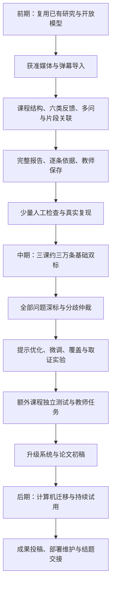

# 项目实施计划

## 一、总体安排

项目名称为“面向录播网课的弹幕驱动多模态教学反馈解析与教师复盘系统”。前期通过复用已有研究方法完成基本系统，中期围绕三个高数视频约三万条弹幕开展人工标注、模型优化和实验研究，后期进行计算机课程迁移、持续试用与成果整理。

前期参考CoKnowledge的弹幕分类、聚类及视频关联方法，参考EduRABSA的评价对象与情感关系表示，参考EduFeedback-RAG的依据检索和摘要生成方法。具备代码、权重和适用许可的组件可直接复用；其余部分按论文方法实现并说明适配内容。通过统一数据结构连接这些模块，形成从课程输入到教师保存复盘决定的完整流程。

本计划中的样本量、工作量和性能目标均为拟定安排。当前已经形成研究背景、技术路线与报告示意，真实数据取得、模型部署和运行验证仍需实施。已有基础与待完成材料集中列入[申报准备与资料管理说明](../04_申报与答辩/申报准备与资料管理说明.md)。

## 二、样本与标注安排

### 2.1 三个核心视频

选择大学高等数学的复习速通、专题讲解、解题方法三类视频各一个，优先考虑10—40分钟且弹幕约一万条的课程，共规划约三万条核心弹幕。确定样本时综合考察内容完整性、素材使用条件、弹幕覆盖及教师参与条件。弹幕总数以实际合法取得的数据快照为准，分别记录目标值、取得值和有效值。

视频链接用于登记课程来源及分P信息；系统支持授权文件导入，并在具备允许的访问路径后接入自动获取。UP主许可、平台访问条件、反馈文本处理范围和云端处理安排分别记录，按[数据取得路线](../02_合规与授权/B站三视频研究数据路线.md)落实。

### 2.2 全量基础标注与问题深度标注

对三个视频取得的全部弹幕开展基础标注，内容包括教学相关性、六类反馈标签、是否存在信息需求、纯情绪或情绪与提问混合表达。一条记录允许多个标签。重复文本保留来源和出现次数；经核对的重复组可共用部分文本标签，依赖上下文的判断仍须逐条核查。

对所有人工识别出的提问、隐含问题、笼统求助和待核疑问进行深度标注。标注问题单元、原文范围、条件和否定、同义关系、候选课程片段及关联依据。对于无法具体定位的求助，保留原文及不确定状态。额外核查系统判断为非问题的记录，发现早期筛选造成的漏检。

基础标注原则上由两人独立完成，再进行分歧仲裁；深度标注由一人初标、另一人复核，重要测试样本采用独立双标。前期先用200—300条试标，核定定义与速度；申报前累计检查约300—500条真实记录。这些材料进入开发用途，最终测试另行隔离。

### 2.3 独立验证材料

三个核心视频用于深度研究。因为同一视频中的内容与表达高度相关，所以还需少量新课程检验跨课程表现。中期另规划3—6个不同作者的高数视频作为外部测试候选，按完整片段和自然分布抽取材料进行人工标注，无须每个视频达到一万条。外部测试材料在训练和提示调整期间保持隔离。

核心三课可采用留一视频验证：每轮使用两课进行训练与开发，剩余一课评价，共三轮。预先冻结实验方案，不根据测试结果反复选择方法。每课结果分别报告；核心课的课型和作者差异可能相互混杂，所以三轮结果只支持有限范围的迁移判断。

后期规划6—12个计算机视频进行领域迁移研究。先评价固定高数模型，再将少量适配后的结果单独报告。独立课程数较少时，研究结论限定为探索性结果。

## 三、前期任务 申报前完成基本实现

### 3.1 数据与运行环境

确定三类核心课程候选和素材取得方式，建立来源与使用范围记录。部署一个可运行的主模型及语音转写、画面识别服务，记录模型版本、配置、显存与时间。FrameScope源码取得后核查依赖和许可；在源码尚未提供时，通过独立接口实现必要音视频功能。

### 3.2 课程结构与反馈解析

实现带时间的转录、必要板书截图、章节与知识点组织，使教师能够回到对应讲解。接入已有分类和关联方法，形成问题与求助、知识交流、理解状态自述、学习情绪、教学评价和改进建议六类并列视图。

区分纯情绪与信息需求，拆分一条弹幕中的多项问题。保留具体、隐含、笼统和单次求助，通过时间与语义形成候选片段，聚合相同信息需求。正负条件不同的问题分别保存，未归属内容保留独立入口。

### 3.3 完整报告与教师操作

报告呈现课程概览、显著显示的知识点数和弹幕数、播放位置上的弹幕数量分布、课程结构、阶段反馈、内容总结、问题概述、主题词云和精确频数表。教学相关表扬与改进线索均提供原文依据。

所有分析支持查看单条弹幕及相关课程材料。教师能够修改标签与归属、合并或拆分问题、记录保留或改进决定。操作写入持久存储，刷新和重启后可读取。JSON与HTML报告使用同一份数据生成。

### 3.4 人工检查与基本系统验收

通过约300—500条真实记录检查漏问、错误分类、错误合并、片段错位及无依据摘要。检查范围包含系统判为非问题的记录。模型超时、媒体损坏、重复任务和引用失效应有明确处理结果，统计不得因重试重复累加。

前期交付一套真实运行的基础系统、源代码、部署说明、三课运行状态表、报告样例、演示录屏和错误记录。全部基本功能均须通过真实输入运行；至少一课由第二名成员独立复现，另外两课逐项核查。三课素材未齐时单独标记覆盖缺口。合成材料用于开发调试，真实验收使用获准课程和真实反馈。

前期安排不包含专门模型训练或复杂取证策略研发。通过成熟方法集成保留足够的时间完成实际输入输出。

## 四、中期任务 立项后至中期检查前

中期承担全量标注、训练、方法研究、产品加强与教师评价，投入明显高于前期。工作按以下顺序组织。

### 4.1 完成三课约三万条人工数据

完成试标、指南修订、双人基础标注、问题深度标注及分歧仲裁。抽取报告结论建立独立证据核查集，首批规划300—500条结论。归属标注覆盖全部问题候选，并记录最终单元数量；试标后估计深度工作量。

设置固定测试集，记录课程、作者与重复组划分。合成扩增仅用于有明确标记的训练材料。标注指南调整后，旧试标转入开发材料；最终测试标签保持独立。

### 4.2 建立基线并开展模型优化

固定前期系统作为基线，对照简单规则、文本模型、CoKnowledge式处理及EduFeedback-RAG式摘要。对于无法完整运行作者代码的情况，说明方法适配内容与差异。

通过前期错误确定模型优化目标，比较提示调整、专门抽取模型和低秩适配微调。低秩适配指训练少量新增参数，以减少训练成本。重点检验隐含求助、一条多问、混合表达和评价对象识别。保留同一基础模型未经训练的结果，区分训练带来的变化和模型更换带来的变化。

### 4.3 研究问题覆盖与局部取证

当普通摘要遗漏单次问题或关键条件时，研究问题单元到摘要句的覆盖关系，在相同篇幅下比较不同摘要方法。设置“普通摘要加完整问题列表”作为强基线，检验新增算法的实际贡献。

当转录或时间邻域无法确定指代时，比较固定检索、增加板书和按需补证。按需补证先采用明确规则，数据支持后再训练选择器。工具调用限定在本课程材料，设置次数和费用限制。通过对照记录由错变对及由对变错的情况，从而判断视觉输入和取证策略的适用范围。具体方案见[核心创新与验证方案](核心创新与验证方案.md)。

### 4.4 加强系统与报告

完善任务队列、断点恢复、课程隔离、输入校验、资源监测、报告导出和教师修订记录。优化高数术语、公式和课程片段检索，处理反馈滞后与跨段指代。报告明确表示多个候选、缺失材料和待核状态，同时保持完整问题清单与积极反馈入口。

### 4.5 教师研究与独立评测

先规划3—5位教师参与形成性试用，通过访谈与操作观察发现界面问题。随后规划8—12位教师进行任务比较，评价固定时间内的正确发现、错误判断、证据定位时间和行动质量。采用平衡顺序，尽量由不了解系统条件的学科人员判断结果。

完成标签、问题、聚合、归属、摘要和教师任务评价。逐项报告检验对象、指标数值、不确定范围和含义。对三课约三万条材料的处理效果与额外课程结果分开呈现。招募或课程数量不足时，明确限制结论范围。

### 4.6 中期成果

形成升级系统、全量标注及指南、基线和方法对照、外部课程测试、教师试用记录、费用分析、复现材料和论文完整初稿。研究重点根据实际错误收敛到一至两项方法；如果复杂方法没有改善主要结果，则保留表现更好的基础方法并解释原因。

论文投稿、软件著作权及专利评估依据实际成果推进。中期材料分别列明计划、已完成实验、投稿和申请状态。

## 五、后期任务 中期检查后至结题

开展计算机课程迁移，分析术语、课程结构和反馈表达变化。根据中期结果选择补标、训练或检索改进，不同时增加缺少实验依据的新模块。

争取2—3个课程团队开展6—8周持续试用，观察教师如何查看依据、采纳或拒绝建议，以及课程修改的实际情况。正面与不利结果均纳入分析，学习成绩变化另需专门研究设计。

完成权限管理、备份恢复、数据删除、成本监控、部署和用户说明。整理许可允许公开的代码、标注规范、评测脚本和演示材料。开展论文修订与投稿，按具体技术成果办理相应知识产权事项。

按学校要求参加中国国际大学生创新大赛等赛事，并结合届时资格准备全国大学生创新年会论文交流或成果展示。扩大推广前落实稳定数据来源、处理权限和维护责任。

结题交付当前系统、研究论文或报告、实验与数据说明、教师应用案例及交接文档。由非主要开发成员重新部署，检查教师能否独立完成导入、复盘、保存和导出。

## 六、时间与人力安排

学校2027批次通知规定学生申报截至2026年9月22日，10月中下旬开题，2027年3月中期检查确定国家级、省级，创新训练执行期原则上1.5年。学院内部安排另行核实。以下研发时间为项目安排。[学校通知](https://chuangxin.dlut.edu.cn/info/1022/16637.htm)

| 时段 | 主要交付 |
|---|---|
| 申报前，内部目标9月21日 | 成熟方法集成、真实基本系统、少量人工检查、申报材料 |
| 2026年9月下旬—10月 | 系统稳定、试标、指南与测试划分、素材落实 |
| 11—12月 | 三课全量基础标注、问题深标、基线与首轮专项训练 |
| 2027年1月 | 完成仲裁、覆盖与取证实验、教师形成性试用 |
| 2月—3月中期检查前 | 独立测试、教师任务评价、论文初稿、中期成果 |
| 中期后至结题 | 计算机迁移、持续试用、成果投稿、部署交接 |

四名成员分工：A负责数据治理与研究统筹，B负责文本标注及模型训练，C负责音视频与片段关联，D负责报告系统及教师实验。基础标注按双人交叉分配，关键代码和结果另有成员复核。导师及学科人员参与方法审阅和困难样本仲裁。

全量双标的基础时间计算为：记录数×每条平均标注秒数×2÷3600。三万条、每条30秒时约500人时；每条60秒时约1,000人时。该估计尚未包含问题深标、分歧仲裁及程序开发。通过试标测量实际速度，再调整排程和算力投入。

| 阶段 | 四人合计规划人时 |
|---|---:|
| 前期 | 240—320 |
| 中期 | 1,200—1,800 |
| 后期 | 400—600 |

中期投入约为前期的3.8—7.5倍。按24周计算，四人平均每人每周约12.5—18.8小时。全量标注耗时偏高时，优先压缩候选模型和非必要界面研发，保护核心数据质量与独立测试；如仍超出可投入时间，应据实调整进度或研究范围。

## 七、实验标准与风险处理

确定性检查包括引用编号有效、图表与列表计数一致、所有已识别问题可访问、教师操作持久保存、课程材料相互隔离。逐项记录实际结果，缺项阻止宣称完整运行。

研究评价包括问题精确率与召回率、多标签宏平均F1、条件保留、错误合并、片段关联、摘要覆盖与证据支持。性能阈值根据试标结果和教师容错需求预先确定，最终测试不参与调参。费用、拒判比例和教师核查时间同时报告。

数据取得受限时保留获准导入路径；三课约三万条为目标，实际不足需公开数量及原因。独立课程不足会限制推广结论。若音视频或微调增加错误，则修正使用范围。模型更新后重新评价，不将不同配置结果混合成单一成绩。

## 八、研究流程

详细研究背景见[前沿相关研究综述](../03_研究与实验/前沿相关研究综述.md)，具体评价方法见[实验与验证](../03_研究与实验/实验与验证.md)。

## 判定规范与报告联动任务

前期将[教学反馈判定细则](../03_研究与实验/教学反馈判定细则与报告依据.md)落实为规则配置和发现字段，通过300–500条检查完善定义；六类首页与五方面复盘筛选共同进入基本报告。中期开展专家审阅、三万条基础标注和300–500项发现核验，并比较规则与反证检查的增益。后期检查计算机学科的规则适配，保留未适配对照。上述任务纳入原阶段工作包，不重复累计样本量和人时。
