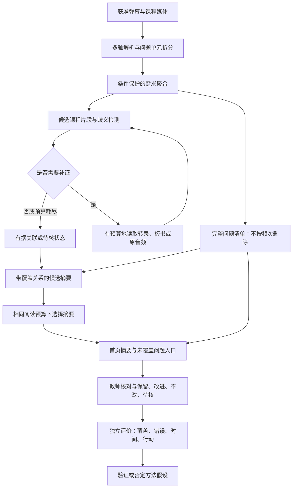

# 面向教师复盘的问题覆盖约束与按需多模态取证研究方案

## 1. 研究定位

建议项目名称：**面向录播网课的弹幕驱动多模态教学反馈解析与教师复盘系统**。

研究目标是从自然弹幕中形成可追溯、少遗漏、可核查的教师复盘报告。系统帮助教师识别值得保留的讲解和需要回应的问题；研究重点是压缩反馈时的信息损失及其对教师判断的影响。六类反馈、词云和时间轴继续保留为产品能力，模型品牌不进入核心创新表述。

本文提出待验证的方法方案，不代表已经实现、达到国家级水平或通过完整新颖性检索。其竞争力须由独立实验、真实教师任务和团队可复现成果支撑。

## 2. 在前人基础上具体前进一步

CoKnowledge已研究弹幕筛选、微调分类、聚类和视频关联，主要服务观看者的知识吸收；EduFeedback-RAG已经组合反馈分类、聚类与证据摘要。前者不以保留全部教师相关问题为主要目标，后者的代表材料检索不等于全体问题覆盖，并明确缺少正式教师人评。MOOC-Rec提供问题到课程片段检索先例，但其笼统问题筛选不适合本项目。详见[相关研究综述](../03_研究与实验/前沿相关研究综述.md)及其中原始引用。

本研究不把“已有系统没有某按钮”作为创新依据，而提出一个可检验的矛盾：教师的阅读时间有限，系统必须压缩材料；但压缩可能掩盖低频问题、相反条件和模糊求助。更长摘要也未必更有用。因此需要研究**给定阅读预算下，如何保留更多不同信息需求，同时控制误报、错误归属和核查成本**。

这里的阅读预算指首页可展示的字数或议题数，教师时间在用户实验中另行测量；两者不视为完全等价。数据范围限定为合法取得的快照，不扩张到所有观看者。

## 3. 核心方法一：问题覆盖约束的分层摘要

### 3.1 表示对象

一条弹幕先拆成零个或多个问题单元，每个单元保留原文范围、所问对象、条件、否定、疑问类型和明确度。无法具体化的“这里没懂”作为笼统求助保存，不凭视频补造详细问题。表达中的情绪另设标签，不与提问互相排斥。

在单元之上建立信息需求簇。同义表达可以合并；对象相同但条件、否定或求解目标不同的单元原则上不能直接合并。每个合并决定保留成员与依据，教师能够拆分。问题清单包含所有已识别单元，未归属和单次表达均可进入。

### 3.2 摘要生成的约束

先从问题簇生成候选摘要句，再选择首页展示内容；每句必须列出其覆盖的问题单元。设Q为已识别问题单元集合，S为候选摘要句集合，a(q,s)表示经判别摘要句s是否准确覆盖问题q。它要求所问对象及关键条件不被改变，不能只凭向量相似度认定。

给定字数预算B，选择摘要子集A，使下式尽可能大：

覆盖收益(A) = Σq wq · I[存在s∈A使a(q,s)=1] − λ·冗余(A)

约束为Σs∈A length(s)≤B，且每句来源有效、不存在未处理的关键条件冲突。权重wq首先按不同信息需求均衡设置，防止重复刷屏天然主导；频次加权作为对照条件。λ及阈值只在开发集确定。该形式借鉴覆盖优化思想，本身不是新算法主张，研究贡献需来自适合弹幕问题的覆盖判别、条件保护及验证。

选择后计算未覆盖集合，并展示可展开的补充问题入口。首页允许有限覆盖，完整清单必须可达；界面不能暗示首页已穷尽所有问题。统计、清单与摘要的引用来自同一份数据。

### 3.3 相对已有工作的可验证增量

比较直接摘要、聚类代表句摘要、普通检索摘要与本方法，在相同字数和输入下测量不同信息需求覆盖、条件保留、单次问题召回及错误新增。必须加入一个强而简单的基线：普通摘要加完整列表。若提升仅来自列表入口，不能宣称覆盖选择算法有效。

该方法的主要假设是：显式跟踪每个问题的去向，比只检查摘要句是否有引用更能减少遗漏。编号守恒属于工程条件；语义覆盖判别和预算分配是否有效属于研究问题。

## 4. 核心方法二：以歧义为触发条件的局部多模态取证

不为每条弹幕处理整段视频，而为疑难问题选择下一项证据操作。操作包括读取相邻转录、向前扩展片段、查看关键板书帧、核对原音频或转教师复核。教师报告只使用当前课程授权材料。

首先建立固定时间与语义检索基线。再利用人工标注的错误类型和候选冲突识别需要补证的情况，例如多个可能指代、公式条件缺失、转写与画面不一致。模型自报信心不直接当概率。

在开发集上学习或校准各操作的选择规则，目标是在给定调用预算下增加正确关联，减少无效补证。训练标签来自实际补证前后的人工判断；离线比较同一问题使用不同证据后的变化，不将模型互相同意当正确。第一轮采用可解释规则选择，数据支持后再训练轻量选择器。

每条问题最多补证2—3轮，遇到稳定证据或预算耗尽即停止。允许多个候选和无法归属；不能通过大量拒判制造高准确率。音视频只能帮助解释已存在的反馈，不生成想象中的学生问题或教学因果结论。

该方法必须与固定邻域、时间加语义检索、固定多模态输入比较。另报告相同调用次数和相近费用的比较，防止多花算力造成假方法优势。若按需选择不优于固定方法，则保留固定取证，不把Agent名称当成果。

## 5. 教师任务验证：判断是否改善，而非只问是否喜欢

教师需要完成两类对称任务：发现有依据的困难与改进机会，以及发现值得保留的讲解。报告允许“保留、不改、改进、待核”，不把采纳建议越多视为越好。

先由教师与学科评审建立任务参照，接受多种合理行动，记录分歧；评审尽量不知道报告条件。正式比较包括原始材料、基础报告、覆盖约束报告和加入按需取证的报告。采用平衡顺序和不同课程任务，避免反复看同一视频的学习效应。

主要结果是在固定时间内依据成立的发现数和错误发现数，另报告行动具体性、证据定位时间及工作负担。研究分析同时考虑教师和课程差异。形成性试用用于改设计，正式评价数据不能反复用于调提示。

这部分是系统有效性研究，不单独宣称新的教育理论。若只改善主观满意度，就如实限定结论；若实际行动更差，则分析误导来源而不是隐藏不利结果。

## 6. 数据与标注形成可复用研究资源

建立分层标注：原始记录→表达轴→问题单元→需求簇→候选课程片段→摘要覆盖关系→教师判断。每层保留来源和不确定状态，测试从清洗前材料抽样，以发现早期过滤造成的漏检。

三条核心高数课程用于前期基本实现和中期约三万条弹幕的全量基础标注、全部问题深入标注；额外课程用于独立测试。训练与测试按作者和课程条件隔离；重复上传或近重复片段不能跨集合。自然分布测试与难例测试分开报告，不能用故意增加的难例估计自然发生比例。独立测试不含生成弹幕或改写扩增样本。

双人独立标注与仲裁记录用于衡量规则是否可重复；一致性不是标签有效性的充分证明。涉及公式与教学行动的判断由具备相应知识的人员参与。可公开标注规范、合法示例、评测脚本和允许发布的材料，不承诺公开无权再分发的弹幕与视频。

资源建设是贡献候选之一，但不能仅凭数据量声称高质量或新颖；需要明确已有资源覆盖不了哪些任务，以及新标注实际支持了什么检验。

## 7. 实验结构与否定条件

| 实验 | 控制因素 | 主要观察 |
|---|---|---|
| 问题拆分 | 同底座、相同输入 | 多问与隐含求助召回、误新增 |
| 条件保护聚合 | 相同单元集合 | 错合并、过度拆分、否定与条件保留 |
| 覆盖约束摘要 | 相同字数/议题预算 | 需求覆盖、低频覆盖、语义支持 |
| 按需证据选择 | 相同来源、匹配调用预算 | 归属正确性、拒判覆盖、费用 |
| 教师任务 | 同等原材料访问与固定时间 | 正确/错误发现、行动质量、耗时 |
| 跨作者/跨领域 | 冻结模型及规则 | 新课程性能变化、具体失败类别 |

先冻结主要指标和有实际意义的改善门槛，再进行最终测试。分类宏平均F1、问题召回与精确率、覆盖率都按明确单位计算；不跨论文比较不同任务的分数。报告每课结果及不确定范围，样本不足不声称统计上已证明优越。

若覆盖约束只增加篇幅而不提高同预算覆盖，则核心假设未获支持；若多模态只增加成本，应简化；若教师更快但更常误判，应修订界面与解释。负结果可以形成可信研究结论，但不能包装成预定创新已经成功。

## 8. 实施收敛与成果安排

申报前仍按[阶段计划](分阶段开发与成果计划.md)完成真实基本链路，不要求先训练复杂选择器。工程上先落实问题单元、完整清单、逐条依据和教师保存，保留所有中间结果供后续研究。

中期前把**问题覆盖约束摘要**作为主研究；条件保护聚合是其必要组成。按需多模态取证作为第二研究模块，教师任务实验验证整个系统。优先确保主方法有充分对照，再决定是否深化第二模块，不同时铺开多个无独立证据的Agent。

建议论文主线为“阅读预算约束下的录播课程问题覆盖与教师复盘”，结果不足时如实收缩主张。软件系统、标注资源和教师案例共同支撑国家级分级评审；论文投稿和专利评估以实际成果为前提。形式化覆盖目标、六类首页、采用开源模型或Agent本身均不构成专利授权或国家级认定保证。

## 9. 研究方法图

方法图中的回路受最大调用次数约束。教师修订进入后续训练前重新划分用途，最终测试保持隔离。

