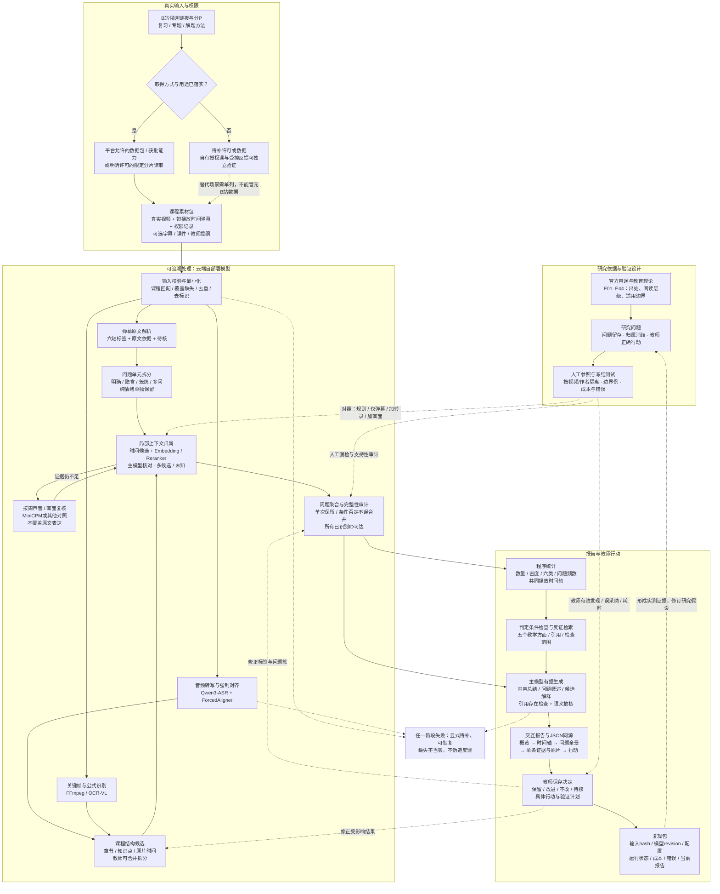

# 研究与工程总图

实线表示计划数据处理；虚线表示验证、修订或异常路径。全图是目标架构，当前没有真实端到端运行验收。主模型首选候选为Qwen3.8-27B，实际使用以独立小样本评测和部署成功记录为准。

图中的回路有两种：工程回路是教师修正后重新生成当前报告；研究回路是独立验证结果反过来修改假设和方法。只有工程跑完不能宣布科学有效。音视频的作用是内容取证与局部消歧，不能生成不存在的学生反馈。

阅读顺序：[总体设计](总体设计.md) → [证据闭环审计](../03_研究与实验/证据闭环审计.md) → [模型与工程研究](../06_工程闭环/开放模型与工程闭环研究.md) → [逐环节说明](../06_工程闭环/环节说明/00_阅读导航.md) → [立项前验收](../06_工程闭环/立项前实施与验收.md)。

规则和证据状态见[教学反馈判定细则](../03_研究与实验/教学反馈判定细则与报告依据.md)。六类反馈用于分类检索，五个方面用于教师复盘，三类状态分别记录反馈依据、内容核验及教师决定。
