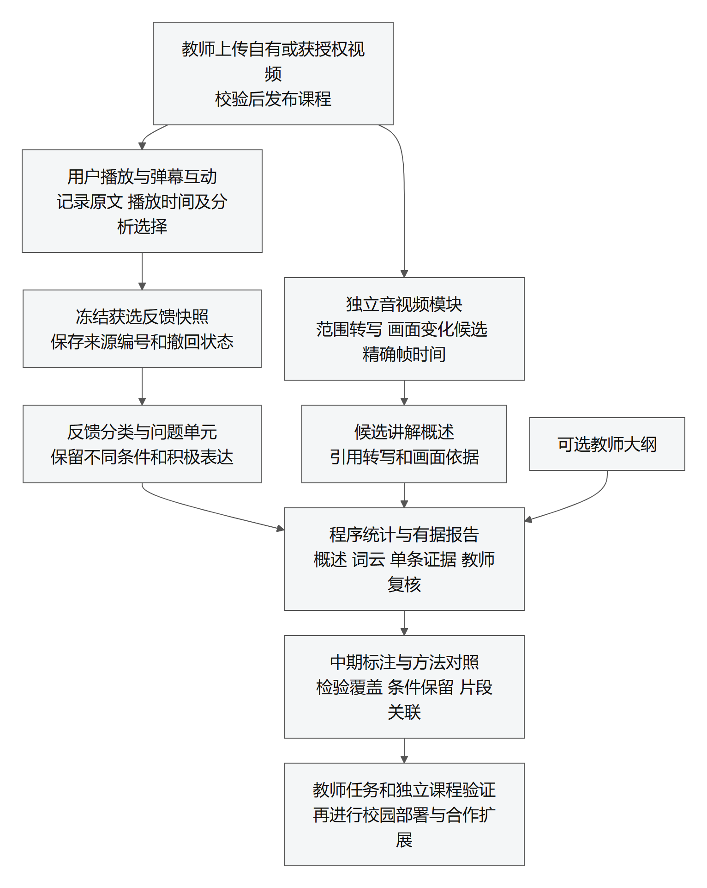
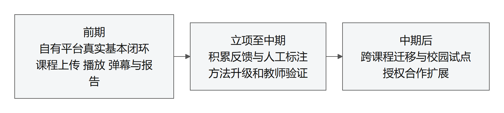

# 大连理工大学大学生创新训练项目申报书

## 一、项目基本信息

项目名称：面向自有网课平台的多模态教学反馈解析与教师复盘系统

项目类型：创新训练项目  
申报单位：大连理工大学软件学院  
申报批次：2027年大学生创新创业训练计划  
学科方向：软件工程、自然语言处理、教育技术  
项目来源：________  
负责人学号及联系方式：________  
项目负责人：________  
团队成员：________、________、________  
指导教师：________  
执行时间：________至________

## 二、项目简介

本项目建设集视频上传、播放与弹幕互动于一体的网课教学平台，研究基于平台内反馈的多模态教师复盘方法。教师上传具有相应使用权的课程，学生在播放位置提问和交流，系统以明确的分析选择形成固定快照，结合课程转写、证据画面和教学大纲生成可回查报告。团队已完成平台基本功能及自制短课程的本地模型闭环。中期通过真实课程逐步积累反馈并开展人工标注，重点研究多问识别、条件保护聚合、摘要覆盖与讲解片段定位，通过独立课程和教师任务检验效果。后期开展计算机课程迁移及校园部署试点，外部视频平台保留为授权合作扩展。项目形成可复现平台、标注规范和研究成果，为教师回应具体疑问、保存有效讲解及制定改进措施提供支持。

## 三、研究问题与已有研究

录播教学中的学生反馈分散在不同播放位置。教师需要知道学生提出了哪些不同问题、问题指向哪段讲解，以及哪些内容值得保留或补充。一条弹幕可能同时包含理解自述、情绪和多个问题，直接生成整课摘要容易合并不同条件或遗漏低频疑问。因此，本项目将课程播放与反馈形成纳入自有平台，再研究如何把原始表达组织为便于教师核查的证据。

Cai与Wei对教育视频弹幕认知参与的研究为反馈分类提供先例[1]。CoKnowledge通过分类、聚类与视频关联组织时间同步评论，为多层次浏览提供参照[2]。EduRABSA将教育评论中的评价方面与倾向分开，适用于同时包含肯定和改进意见的表达[3]；有依据的学生反馈摘要研究支持将分类、聚类和检索结合[4]。本项目借鉴这些处理与交互方法，将使用任务转向教师复盘，并通过自有课程形成可记录来源的反馈。

MOOC-Rec与PedagogyBench分别提供问题关联教学片段及教学视频理解的研究参照[5–6]。学习分析仪表盘评价研究强调从使用任务检验系统价值[7]，引用生成研究则提示需要分别检查引用完整性及其语义支持[8]。这些研究的数据与场景不同，原有成绩不能直接作为中文高数课程的分析效果。

项目集中研究有限阅读篇幅下的问题覆盖与证据定位。上传、播放器和账号系统提供研究环境；多问拆分、条件保护聚合和有据摘要承担方法研究；教师任务实验检验这些改动能否减少遗漏和错误采纳。自建平台不会自动消除版权问题，课程素材及学生数据仍需核实相应处理范围。

## 四、平台运行与研究方法

### 4.1 课程上传与平台反馈形成

教师上传视频及可选教学大纲，确认课程视频、课件与音轨的相应使用权，校验视频后保存草稿，再决定发布。首期不设置班级、邀请码或选课环节，已发布课程向平台注册用户开放；教师只可管理和分析自己上传的课程，草稿仅本人可见。学生在播放器当前时刻发送弹幕，平台保存内部编号、文字、播放位置和发送时间。

观看和互动不以同意模型分析为前提。弹幕发送时单独选择是否用于本地反馈分析，教师生成报告前冻结已同意且未撤回的记录，保留快照与原弹幕编号映射。新弹幕继续进入平台，留待后续快照分析，避免运行过程中输入变化。撤回后旧报告暂停访问，重新生成时排除相应记录；正式试点前进一步落实历史缓存的保留与删除程序。

### 4.2 独立音视频证据模块

音视频模块以课程MP4和选定范围为输入，先取得媒体时长，再提取单声道语音并分块转写。相邻语音块保留少量重叠上下文，按句段中点归属，输出起止时间、文字及识别分数；缓存记录媒体与语音模型权重哈希，使重复运行可核对输入来源。当前使用Whisper开放模型完成本地转写，分数只作复核线索，不能证明公式和数学术语正确。

画面处理每五秒取得一个采样帧，利用缩小后的灰度变化产生候选分界，限制片段最短三十秒、最长一百八十秒，再从候选片段解码代表画面并保存实际帧时间。模型结合该片段转写与画面概述讲解内容，输出可回查的证据编号。画面变化仅是候选线索，板书持续书写、人物运动和静态课件均可能造成误分或漏分。

中期以人工标注的知识点与推导步骤为标准，比较固定时间窗、画面变化候选和语义辅助分段，针对公式或指代不清的问题按需补充局部画面与音频。通过记录补证前后的关联变化及处理成本，判断哪些材料有助于纠错，哪些材料引入了无依据解释。该模块围绕当前课程任务独立设计，不以外部音视频项目的功能作为前置基础。

### 4.3 从弹幕问题到有依据的报告

反馈首先按照问题与求助、知识交流、理解自述、学习情绪、教学评价、改进建议六类进行多标签分析，同时保留积极表达及语义不明项。纯情绪记录进入情绪视图；笼统求助与具体问题进入问题清单。程序核验输出结构、编号范围和覆盖，对未处理记录保留明确状态，不能通过删除难例掩盖错误。

问题单元以可辨识的信息需求为单位。例如“为什么能约掉x，x等于零怎么办”应分别保留约分依据与零值情形，两者均关联原文。归并时可以合并同义表达，但对象、条件、否定或所求内容不同的问题应保持可区分。摘要在相同字数预算下优先覆盖不同需求，首页未展示的问题仍保留在完整列表；人工评价同时检查模型最初的漏检和聚合后的语义遗漏。

问题定位先利用播放位置召回候选讲解，再比较语义及必要的画面证据。发言可能滞后，所以允许向前扩展范围；候选难以区分时保留多个位置或暂不归属。弹幕支持“有人询问某条件”，不能直接支持“教师漏讲”或“学生没有掌握”。教学大纲原文加入后，进一步检查目标、讲解材料与反馈线索之间的对应，不将材料对应写成目标已经达成。

报告按课程概览、讲解片段、问题全景、证据复盘和行动记录组织。教学观察围绕概念与条件、推理衔接、例题方法、结构节奏和音画资料展开；教育部在线课程文件与Quality Matters提供上层关注范围[9–10]，具体指标需要结合平台材料验证。六类标签与教学方面分别回答表达类型和针对对象，不相加生成课程质量总分。

图表中的数量由程序计算，模型负责问题概述和有据解释；每项观察与建议保留引用，教师可点击查看单条原文及相关讲解。程序检查编号存在，独立评价检查引用是否支持结论。平台支持本地推理；API仅分析学生同意指定服务的反馈，并须教师确认课程材料范围。真实远程链路与校园部署待验证。

图1 平台与教学反馈研究技术路线

## 五、分阶段实施与验证

### 5.1 前期完成自有平台基本实现

以已有反馈处理代码和开放模型为基础，完成上传、发布、播放、弹幕发送与撤回、分析选择和固定快照，再串联独立音视频模块与报告交互。采用自制视频检查格式与权限，随后取得教师自有或获授权课程开展真实试用。前期至少完成一课从真实互动到模型报告及单条证据回看的完整路径，保留输入范围、快照、模型版本和复现说明。

当前已完成平台基本功能及自制短课程的本地模型试跑。下一步重点核对真实课程播放兼容性、不同反馈表达、视频与弹幕时间对齐及教师操作。先对200—300条自然反馈和单列难例试标，完善分类与问题定义，由另一名成员复现同一快照。合成弹幕用于工程验证，不计入真实学生样本或模型准确率。

### 5.2 立项至中期开展主要数据与方法研究

中期围绕复习、专题讲解和方法训练三类高数教学任务，通过实际课程逐步积累数据。约三万条作为阶段性数据建设目标，实际课程数量、独立参与者数量及反馈规模分别报告，不预设每课自然形成一万条。若反馈不足，优先增加独立课程和观察周期，缩小训练范围；不通过重复刷屏或合成数据补足规模。

基础记录进行双人独立标注和分歧仲裁，包括教学相关性、六类标签及教学对象；全部问题进一步标注原文范围、所问对象、条件、否定、多问拆分和关联讲解。抽查非问题记录估计漏检，自然分布样本与补充难例分开统计。标注前测量每条耗时，结合四人可投入时间分批完成，优先保障标准答案质量和独立测试。

方法实验比较普通提示、任务提示与少量参数微调，检验隐含求助、多问及混合表达的改善。摘要比较直接摘要、聚类摘要、普通摘要附完整列表和条件保护的覆盖约束摘要，分别报告问题召回、精确率、条件保留与错误合并。音视频比较固定窗、变化候选和语义辅助定位，记录正确关联、拒判、错误引入及实际耗时。大纲加入前后使用相同课程任务比较目标对应和引用支持。

训练、开发与测试按课程隔离，另保留未用于选择提示、模型及阈值的独立课程，近重复片段不得跨集合。指标同时报告分子、分母及课程级结果；同课大量弹幕不能替代独立课程数量。对比固定输入、分析范围和摘要字数，报告缓存未命中时的耗时与调用成本，不用缓存命中速度证明模型推理提升。

先邀请3—5名教师或助教进行形成性试用，再根据招募及试点结果设计8—12名参与者的任务实验。基础报告与升级报告均可访问相同原始材料，使用难度相近的任务并平衡顺序，主要比较固定时间内依据成立的问题和亮点数量、错误采纳及核查耗时。中期形成标注规范、升级模型与处理方法、组件对照结果、教师评价和论文初稿。

### 5.3 中期后开展迁移与校园试点

冻结高数阶段方法，选取独立计算机课程先直接测试，再利用少量材料适配并比较，区分原有迁移能力与新增训练作用。进一步完善教师资格、任务队列、访问控制、存储配额、撤回及数据保留程序，完成校园服务器真实接入测试后，为在校师生提供日常便捷教学辅学工具。

第三方视频平台连接保留为合作扩展，优先对接授权导出、官方能力或范围明确的数据转交。旧接入代码不作为自动启用或数据使用许可。成果阶段整理可公开代码与规范、撰写论文、办理软件著作权，并在具体技术方案成熟后评估专利；录用、授权与推广规模根据实际结果报告。

图2 阶段安排

## 六、创新重点与已有条件

第一项研究重点是在教师有限阅读篇幅下保持不同问题的信息需求。通过多问拆分、条件保护、摘要覆盖与原文追溯，比较相同展示预算下保留的信息及错误引入；普通摘要附完整清单作为必要对照，从而区分方法作用与单纯增加列表入口的作用。

第二项研究重点是面向具体疑问的局部多模态取证。通过候选片段定位和按需补证，分析语音、文字和画面分别在何种错误类型下发挥作用，以证据支持、误归属和成本联合评价。自有平台使视频、播放位置及反馈来源能够在同一系统内记录，为复现提供条件；不能仅将平台搭建或通用模型组合宣称为方法创新。

团队由大连理工大学软件学院四名本科生组成，已有反馈分类、问题清单、模型引用核验与教师报告代码。新平台已实现账号、上传发布、带范围请求的视频播放、弹幕发送与分析选择。在约15秒自制合成课程上，经平台上传和互动形成一个获选问题，使用独立音视频模块得到四段转写、一张画面，再由本地模型生成含问题和讲解概述的报告。该试验验证工程连通性，未评价真实教师材料、学生学习效果或知识点分段准确率。

此前第三方课程取得7200条弹幕并完成100条局部本地分析的试验，只保留为既有处理能力记录，不迁移为平台自有课程，也不计入新平台自然样本。团队可租用云GPU，但专用权重尚未训练、校园服务器尚未真实接入，真实教师与学生试用仍需落实。

负责人承担研究统筹与数据治理，三名成员分别负责平台与交互、文本与模型实验、音视频与片段关联；四人交叉承担标注与复现。分工围绕共享数据结构和独立验证衔接，以实际试标耗时调整工作量。

## 七、进度成果与经费

申报前完成可复现基本平台与真实课程准备，2026年9月下旬至2027年3月中期检查前集中进行数据建设、方法升级、独立验证和教师研究；中期后进行跨课程迁移、校园部署及成果整理。执行起止时间以学校安排为准，确保成员毕业前结题。

预期形成可运行平台、反馈标注资料、问题覆盖与片段关联方法及评价程序。约三万条为逐步积累目标，不作为未经落实的既有资源。经费结合真实算力、存储、标注与教师研究需求确定，预算金额按导师意见和学校财务规定填写。

| 经费项目 | 金额 元 | 具体用途 |
|---|---|---|
| 算力与存储 | ________ | 模型推理、专项训练、视频与受控资料存储 |
| 资料与研究材料 | ________ | 标注组织及必要研究材料 |
| 实验与成果交流 | ________ | 教师任务研究及规定范围内的交流 |
| 知识产权及其他支出 | ________ | 根据实际成果办理 |
| 合计 | ________ | |

## 八、权利边界与研究风险

自有平台仍需核实课程视频、课件、图片与音轨的相应权利。上传声明用于记录责任和范围，不能替代必要的权利证明审核。学生反馈涉及的告知、分析选择、撤回和保存期限按实际研究安排落实，正式试点前完成相应伦理及数据管理程序。原文在平台可见不代表可以公开发布或发送给任意外部模型。

自然反馈可能稀疏，课程和参与者存在选择偏差，弹幕不能代表所有观看者。转写、画面变化与模型解释均可能出错，所以评价同时保留难例、拒判和错误记录。理解自述限于文字表达，系统不输出真实掌握率、学生心理诊断或课程总质量等级。开展学习效果研究时，需要另行设计对应测验与可比较条件。

团队使用人工智能工具辅助开发、资料整理和文字编辑，由成员核验来源、代码及结果，按学校与投稿要求披露使用情况。

## 九、主要参考文献

[1] Cai Z, Wei S. Examining Learners’ Cognitive Engagement in Danmaku Comments. CSCL, 2022: 579–580. https://zhenyao-cai.github.io/documents/zcai_cscl2022.pdf

[2] Zhang Y, Wang Y, Wang X, et al. CoKnowledge: Supporting Assimilation of Time-synced Collective Knowledge in Online Science Videos. CHI, 2025. DOI: 10.1145/3706598.3713682. https://arxiv.org/html/2502.03767v1

[3] Hua Y C, Denny P, Wicker J, Taskova K. EduRABSA: An Education Review Dataset for Aspect-based Sentiment Analysis Tasks. arXiv:2508.17008, 2025. https://arxiv.org/html/2508.17008v1

[4] Baimukanova Z, Saparbekov Y, Ha H, Lee M H. Evidence-Grounded LLM Summarization for Actionable Student Feedback Analysis. Information, 2026, 17(4): 351. DOI: 10.3390/info17040351.

[5] Zhu, Yang, Hauff. MOOC-Rec: Instructional Video Clip Recommendation for MOOC Forum Questions. EDM, 2022. https://educationaldatamining.org/edm2022/proceedings/2022.EDM-posters.86/index.html

[6] Jin et al. PedagogyBench: A Cognitive-Driven Benchmark for Multimodal Instructional Video Understanding. Findings of ACL, 2026: 12621–12647. https://aclanthology.org/2026.findings-acl.614/

[7] Kaliisa R, Jivet I, Prinsloo P. A checklist to guide the planning, designing, implementation, and evaluation of learning analytics dashboards. International Journal of Educational Technology in Higher Education, 2023, 20: 28. DOI: 10.1186/s41239-023-00394-6.

[8] Gao et al. Enabling Large Language Models to Generate Text with Citations. EMNLP, 2023. https://aclanthology.org/2023.emnlp-main.398/

[9] 教育部. 关于加强高等学校在线开放课程建设应用与管理的意见. 2015. https://www.moe.gov.cn/srcsite/A08/s7056/201504/t20150416_189454.html

[10] Quality Matters. Higher Education Rubric: Course Design Rubric Standards. Seventh Edition. https://www.qualitymatters.org/qa-resources/rubric-standards/higher-ed-rubric

## 十、审核意见

指导教师意见：

________________________________________________________________

________________________________________________________________

指导教师签名：________    日期：________

学院审核意见：

________________________________________________________________

________________________________________________________________

负责人签名：________    学院盖章：________    日期：________
